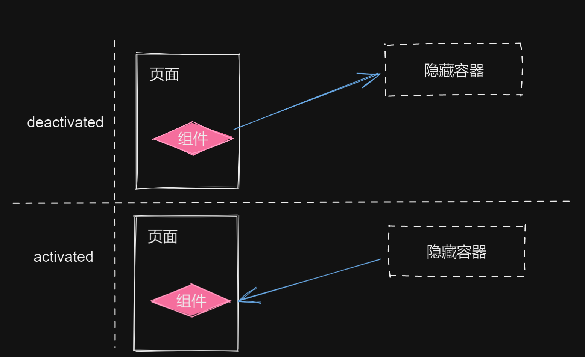
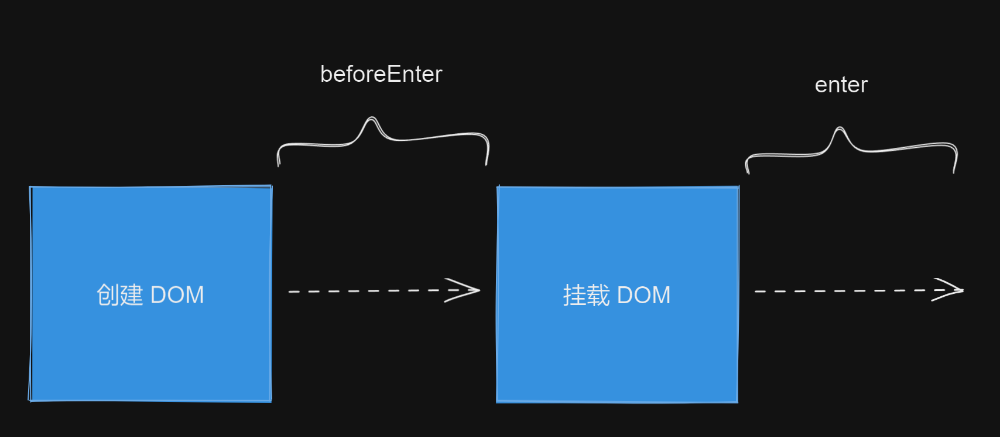

# 内建组件和模块

## KeepAlive 组件的实现原理

### 组件的激活与失活

KeepAlive 一词借鉴于 HTTP 协议。在 HTTP 协议中，KeepAlive 又称 **HTTP 持久连接（HTTP persistent connection）**，其作用是允许多个请求或响应共用一个 TCP 连接。在没有 KeepAlive 的情况下，一个 HTTP 连接会在每次请求/响应结束后关闭，当下一次请求发生时，会建立一个新的 HTTP 连接。频繁地销毁、创建 HTTP 连接会带来额外的性能开销，KeepAlive 就是为了解决这个问题而生的。

HTTP 中的 KeepAlive 可以避免连接频繁地销毁/创建，与 HTTP 中的 KeepAlive 类似，Vue.js 内建的 KeepAlive 组件可以避免一个组件被频繁地销毁/重建。假设我们的页面中有一组 `<Tab>` 组件，如下面的代码所示：

```vue
<template>
	<Tab v-if="currentTab === 1">...</Tab>
	<Tab v-if="currentTab === 2">...</Tab>
	<Tab v-if="currentTab === 3">...</Tab>
</template>
```

可以看到，根据 `currentTab` 的值不同，会渲染不同的 `<Tab>` 组件。当用户频繁地切换 Tab 时，会导致不停地卸载并重建对应的 `<Tab>` 组件。为了避免因此产生的性能开销，可以使用 KeepAlive 组件来解决这个问题，如下面的代码所示：

```vue
<template>
	<!-- 使用 KeepAlive 组件包裹 -->
	<keep-alive>
    <Tab v-if="currentTab === 1">...</Tab>
    <Tab v-if="currentTab === 2">...</Tab>
    <Tab v-if="currentTab === 3">...</Tab>
  </keep-alive>
</template>
```

这样，无论用户怎样切换 `<Tab>` 组件，都不会发生频繁的创建和销毁，因而会极大地优化对用户操作的响应，尤其在大组件的场景下，优势会更加明显。那么，KeepAlive 组件的实现原理是怎样的呢？其实 KeepAlive 的本质是缓存管理，再加上特殊的挂载/卸载逻辑。

首先，KeepAlive 组件的实现需要渲染器层面的支持。这是因为被 KeepAlive 的组件在卸载时，我们不能真的将其卸载，否则就无法维持组件的当前状态了。正确的做法是，将被 KeepAlive 的组件从原容器搬运到另外一个隐藏的容器中，实现 “假卸载”。当被搬运到隐藏容器中的组件需要再次被 “挂载” 时，我们也不能执行真正的挂载逻辑，而应该把该组件从隐藏容器中再搬运到原容器。这个过程对应到组件的生命周期，其实就是 activated 和 deactivated。

下图描述了 “卸载” 和 “挂载” 一个被 KeepAlive 的组件的过程：



如上图所示，“卸载” 一个被 KeepAlive 的组件时，它并不会真的被卸载，而是会被移动到一个隐藏容器中。当重新 “挂载” 该组件时，它也不会被真的挂载，而会被从隐藏容器中取出，再 “放回” 原来的容器中，即页面中。

一个最基本的 KeepAlive 组件实现起来并不复杂，如下面的代码所示：

```js
const KeepAlive = {
  // KeepAlive 组件独有的属性，用作标识
  __isKeepAlive: true,

  setup (props, { slots }) {
    // 创建一个缓存对象
    // key: vnode.type
    // value: vnode
    const cache = new Map()
    // 当前 KeepAlive 组件的实例
    const instance = currentInstance
    // 对于 KeepAlive 组件来说，它的实例上存在特殊的 KeepAliveCtx 对象，
    // 该对象由渲染器注入
    // 该对象会暴露渲染器的一些内部方法，其中 move() 函数用来将一段 DOM 移动到另外一个容器中
    const { move, createElement } = instance.KeepAliveCtx

    // 创建隐藏容器
    const storageContainer = createElement('div')

    // KeepAlive 组件的实例上会被添加两个内部函数，分别是 _deActivate 和 _activate
    instance._deActivate = vnode => move(vnode, storageContainer)
    instance._activate = (vnode, container, anchor) => move(vnode, container, anchor)

    return () => {
      // KeepAlive 的默认插槽就是要被 KeepAlive 的组件
      let rawVNode = slots.default()
      // 如果不是组件，直接渲染即可，因为非组件的虚拟节点无法被 KeepAlive
      if (typeof rawVNode.type !== 'object') return rawVNode

      // 在挂载时先获取缓存的组件 vnode
      const cacheVNode = cache.get(rawVNode.type)

      if (cacheVNode) {
        // 如果有缓存的内容，则说明不应该执行挂载，而应该执行激活
        // 继承组件实例
        rawVNode.component = cacheVNode.component
        // 在 vnode 上添加 keptAlive 属性，标记为 true，避免渲染器重新挂载它
        rawVNode.keptAlive = true
      } else {
        // 如果没有缓存，则将其添加到缓存中，这样下次激活组件时就不会执行新的挂载动作了
        cache.set(rawVNode.type, rawVNode)
      }

      // 在组件 vnode 上添加 shouldKeepAlive 属性，并标记为 true，避免渲染器真的将组件卸载
      rawVNode.shouldKeepAlive = true
      // 将 KeepAlive 组件的实例也添加到 vnode 上，以便在渲染器中访问
      rawVNode.keepAliveInstance = instance

      // 渲染组件 vnode
      return rawVNode
    }
  }
}
```

从上面的实现中可以看到，与普通组件的一个较大的区别在于，KeepAlive 组件与渲染器的结合非常深。首先，KeepAlive 组件本身并不会渲染额外的内容，它的渲染函数最终只返回需要被 KeepAlive 的组件，我们把这个需要被 KeepAlive 的组件称为 “内部组件”。KeepAlive 组件会对 “内部组件” 进行操作，主要是在 “内部组件” 的 vnode 对象上添加一些标记属性，以便渲染器能够据此执行特定的逻辑。这些标记属性包括如下几个：

+ `shouldKeepAlive`：该属性会被添加到 “内部组件” 的 vnode 对象上，这样当渲染器卸载 “内部组件” 时，可以通过检查该属性得知 “内部组件” 需要被 KeepAlive。于是，渲染器就不会真的卸载 “内部组件”，而是会调用 `_deActivate()` 函数完成搬运工作，如下面的代码所示：

  ```js
  function unmount (vnode) {
    if (vnode.type === VNODE_TYPES.Fragment) {
      vnode.children.forEach(c => unmount(c))
      return
    } else if (typeof vnode.type === 'object') {
      // vnode.shouldKeepAlive 是一个布尔值，用来标识该组件是否应该被 KeepAlive
      if (vnode.shouldKeepAlive) {
        // 对于需要被 KeepAlive 的组件，我们不应该真的卸载它，而应该调用该组件的父组件
        // 即 KeepAlive 组件的 _deActivate() 函数使其失活
        vnode.keepAliveInstance._deActivate(vnode)
      } else {
        unmount(vnode.component.subTree)
      }
      return
    }
  
    const parent = vnode.el.parentNode
    if (parent) {
      parent.removeChild(vnode.el)
    }
  }
  ```

  可以看到，`unmount()` 函数在卸载组件时，会检测组件是否应该被 KeepAlive，从而执行不同的操作；

+ `keepAliveInstance`：“内部组件” 的 vnode 对象会持有 KeepAlive 组件实例，在 `unmount()` 函数中会通过 `keepAliveInstance` 来访问 `_deActivate()` 函数；

+ `keptAlive`：“内部组件” 如果已经被缓存，则还会为其添加一个 `keptAlive` 标记。这样当 “内部组件” 需要重新渲染时，渲染器并不会重新挂载它，而会将其激活，如下面的 `patch()` 函数的代码所示：

  ```js
  function patch (n1, n2, container, anchor) {
    if (n1 && n1.type !== n2.type) {
      unmount(n1)
      n1 = null
    }
  
    const { type } = n2
    if (typeof type === 'string') {
      // ...
    } else if (typeof type === 'object' || typeof type === 'function') {
      if (!n1) {
        // 如果该组件已经被 KeepAlive，则不会重新挂载它，而是会调用 _activate() 函数来激活它
        if (n2.keptAlive) {
          n2.keepAliveInstance._activate(n2, container, anchor)
        } else {
          mountComponent(n2, container, anchor)
        }
      } else {
        patchComponent(n1, n2, anchor)
      }
    } else if (type === VNODE_TYPES.Text) {
      // ...
    } else if (type === VNODE_TYPES.Comment) {
      // ...
    } else if (type === VNODE_TYPES.Fragment) {
      // ...
    }
  }
  ```

  可以看到，如果组件的 vnode 对象中存在 `keptAlive` 标识，则渲染器不会重新挂载它，而是会通过 `keepAliveInstance._activate` 函数来激活它。

我们再来看一下用于激活组件和失活组伯的两个函数：

```js
const { move, createElement } = instance.KeepAliveCtx

// KeepAlive 组件的实例上会被添加两个内部函数，分别是 _deActivate 和 _activate
instance._deActivate = vnode => move(vnode, storageContainer)
instance._activate = (vnode, container, anchor) => move(vnode, container, anchor)

```

可以看到，失活的本质就是将组件所渲染的内容移动到隐藏容器中，而激活的本质是将组件所渲染的内容从隐藏容器中搬运回原来的容器。另外，上面这段代码中涉及的 `move()` 函数是由渲染器注入的，如下面的 `mountComponent()` 函数的代码所示：

```js
  function mountComponent (vnode, container, anchor) {
    // ...

    const instance = {
      state,
      props: shallowReactive(props),
      isMounted: false,
      subTree: null,
      slots,
      mounted: [],
      // 只有 KeepAlive 组件的实例下会有 keepAliveCtx 属性
      keepAliveCtx: null
    }

    // 检测当前要挂载的组件是否是 KeepAlive 组件
    const isKeepAlive = vnode.type.__isKeepAlive
    if (isKeepAlive) {
      // 在 KeepAlive 组件实例上添加 keepAliveCtx 对象
      instance.keepAliveCtx = {
        // move 函数用于移动一段 vnode
        move (vnode, container, anchor) {
          // 本质上是将组件渲染的内容移动到指定容器中，即隐藏容器中
          insert(vnode.component.subTree.el, container, anchor)
        },
        createElement
      }
    }
    // ...
  }
}
```

至此，一个最基本的 KeepAlive 组件就完成了。

### include 和 exclude

在默认的情况下，KeepAlive 组件会对所有  “内部组件” 进行缓存。但有时候用户期望只缓存特定组件。为了使用户能够自定义缓存规则，我们需要让 KeepAlive 组件支持两个 props，分别是 `include` 和 `exclude`。其中，`include` 用来显式地配置应该被缓存组件，而 `exclude` 用来显式地配置不应该被缓存组件。

KeepAlive 组件的 props 定义如下：

```js
const KeepAlive = {
  // KeepAlive 组件独有的属性，用作标识
  __isKeepAlive: true,

  // 定义 include 和 exclude
  props: {
    include: RegExp,
    exclude: RegExp
  },

  setup (props, { slots }) {
    // ...
  }
}
```

为了简化问题，我们只允许为 `include` 和 `exclude` 设置正则类型的值。在 KeepAlive 组件被挂载时，它会根据 “内部组件” 的名称（即 name 选项）进行匹配，如下面的代码所示：

```js
// 创建一个缓存对象
const cache = new Map()
const KeepAlive = {
  __isKeepAlive: true,

  // 定义 include 和 exclude
  props: {
    include: RegExp,
    exclude: RegExp
  },

  setup (props, { slots }) {
    // ...

    return () => {
      let rawVNode = slots.default()
      if (typeof rawVNode.type !== 'object') return rawVNode

      // 获取 “内部组件” 的 name
      const name = rawVNode.type.name
      // 对 name 进行匹配
      if (
        name &&
        (
          // 如果 name 无法被 include 匹配
          (props.include && !props.include.test(name)) ||
          // 或者被 exclude 匹配
          (props.exclude && props.exclude.test(name))
        )
      ) {
        // 则直接渲染 “内部组件”，不对其进行后续的缓存操作
        return rawVNode
      }
			// ...
    }
  }
}
```

可以看到，我们根据用户指定的 include 和 exclude 正则，对 “内部组件” 的名称进行匹配，并根据匹配结果判断是否要对 “内部组件” 进行缓存。在此基础上，我们可以任意扩充匹配能力。例如，可以将 `include` 和 `exclude` 设计成多种类型值，允许用户指定字符串或函数，从而提供更加灵活的匹配机制。另外，在做匹配时，也可以不限于 “内部组件” 的名称，我们甚至可以让用户自行指定匹配要素。但无论如何，其原理都是不变的。

### 缓存管理

在前面的实现中，我们使用一个 Map 对象来实现对组件的缓存：

```js
const cache = new Map()
```

该 Map 对象的键是组件选项对象，即 `vnode.type` 属性的值，而该 Map 对象的值是用于描述组件的 vnode 对象。由于用于描述组件的 vnode 对象存在对组件实例的引用（即 vnode.component 属性），所以缓存用于描述组件的 vnode 对象，就等价于缓存了组件实例。

如下是该组件渲染函数的部分代码：

```js
const cacheVNode = cache.get(rawVNode.type)

if (cacheVNode) {
  // 如果有缓存的内容，则说明不应该执行挂载，而应该执行激活
  // 继承组件实例
  rawVNode.component = cacheVNode.component
  // 在 vnode 上添加 keptAlive 属性，标记为 true，避免渲染器重新挂载它
  rawVNode.keptAlive = true
} else {
  // 如果没有缓存，则将其添加到缓存中，这样下次激活组件时就不会执行新的挂载动作了
  cache.set(rawVNode.type, rawVNode)
}
```

缓存的处理逻辑可以总结为：

+ 如果缓存存在，则继承组件实例，并将用于描述组件的 vnode 对象标记为 keptAlive，这样渲染器就不会重新创建新的组件实例；
+ 如果缓存不存在，则设置缓存。

这里的问题在于，当缓存不存在的时候，总是会设置新的缓存。这会导致缓存不断增加，极端情况下会占用大量内存。为了解决这个问题，我们必须设置一个缓存阈值，当缓存数量超过指定阈值时对缓存进行修剪。但是这又引出了另外一个问题：我们应该如何对缓存进行修剪呢？换句话说，当需要对缓存进行修剪时，应该以怎样的策略修剪？优先修剪掉哪一部分？

Vue.js 当前所采用的修剪策略叫作 “最新一次访问”。首先，你需要为缓存设置最大容量，也就是通过 KeepAlive 组件的 max 来设置，假如：

```vue
<template>
	<KeepAlive :max="2">
  	<component :is="dynamicComp" />
  </KeepAlive>
</template>
```

在上面这段代码中，我们设置缓存的容量为 2。假设我们有三个组件 Comp1、Comp2、Comp3，并且它们都会被缓存。然后，我们开始模拟组件切换过程中缓存的变化，如下所示：

+ 初始渲染 Comp1 并缓存它。此时缓存队列为：[Comp1]，并且最新一次访问（或渲染）的组件是 Comp1；
+ 切换到 Comp2 并缓存它。此时缓存队列为：[Comp1、Comp2]，并且最新一次访问（或渲染）的组件是 Comp2；
+ 切换到 Comp3，并缓存容量已满，需要修剪，应该修剪谁呢？因为当前最新一次访问（或渲染）的组件是 Comp2，所以它是 “安全” 的，即不会被修剪。因此被修剪掉的将会是 Comp1。当缓存修剪完毕后，将会出现空余的缓存空间用来存储 Comp3。所以现在的缓存队列是：[Comp、Comp3]，并且最新一次渲染的组件变成了 Comp3。

我们还可以换一种切换组件的方式，如下所示：

+ 初始渲染 Comp1 并缓存它，此时，缓存队列为：[Comp1]，并且最新一次访问（或渲染）的组件是 Comp1；
+ 切换到 Comp2 并缓存它，此时，缓存队列：[Comp1、Comp2]，并且最新一次访问（或渲染）的组件是 Comp2；
+ 再切换回 Comp1，由于 Comp1 已经在缓存队列中，所以不需要修剪缓存，只需要激活组件即可，但要将最新一次渲染的设置为 Comp1；
+ 切换到 Comp3，此时缓存容量已满，需要修剪。应该修剪谁呢？由于 Comp1 是最新一次被渲染的，所以它是 “安全” 的，即不会被修剪掉，所以最终会被修剪的组件是 Comp2。于是，现在的缓存队列是：[Comp1、Comp3]，并且最新一次渲染的组件变成了 Comp3。

可以看到，在不同的模拟策略下，最终的缓存结果会有所不同。“最新一次访问” 的缓存修剪策略的核心在于，需要把当前访问（或渲染）的组件作为最新一次渲染的组件，并且该组件在缓存修剪过程中始终是安全的，即不会被修剪。

实现 Vue.js 内建的缓存策略并不难，本质上等同于一个小小的算法题目。我们的关注点在于，缓存策略能否改变？甚至允许用户自定义缓存策略？实际上，在 Vue.js 官方的 RFCs 中已经有相关提议。该提议允许用户实现自定义的缓存策略，在用户接口层面，则体现在 KeepAlive 组件新增了 cache 接口，允许用户指定缓存实例：

```vue
<KeepAlive :cache="cache">
  <Comp />
</KeepAlive>
```

缓存实例需要满足固定的格式，一个基本的缓存实例的实现如下：

```js
// 自定义实现
const _cache = new Map()
const cacah = {
  get (key) {
		_cache.get(key)
  },
  set (key, value) {
    _cache.set(key, value)
  },
  delete (key) {
    _cache.delete(key)
  },
  forEach (fn) {
    _cache.forEach(fn)
  }
}
```

在 KeepAlive 组件的内部实现中，如果用户提供了自定义的缓存实例，则直接使用该缓存实例来管理缓存。从本质上来说，这等价于将缓存的管理权限从 KeepAlive 组件转交给用户了。

## Teleport 组件的实现原理

### Teleport 组件要解决的问题

Teleport 组件是 Vue.js 3 新增的一个内建组件，我们首先要讨论它要解决的问题是什么。通常情况下，在将虚拟 DOM 渲染为真实 DOM 时，最终渲染出来的真实 DOM 的层级结构与虚拟 DOM 的层级结构一致。以下面的模板为例：

```vue
<template>
	<div id="box" style="z-index: -1;">
    <Overlay />
  </div>
</template>
```

在这段模板中，`<Overlay>` 组件的内容会被渲染到 id 为 box 的 div 标签下。然而，有时这并不是我们所期望的。假设 `<Overlay>` 是一个 “蒙层” 组件，该组件会渲染一个 “蒙层”，并要求 “蒙层” 能够遮挡页面上的任何元素。换句话说，我们要求 `<Overlay>` 组件的 z-index 层级最高，从而实现遮挡。但问题是，如果 `<Overlay>` 组件的内容无法跨越 DOM 层级渲染，就无法实现这个目标。还是拿上面这段模板来说，id 为 box 的 div 标签拥有一段内联样式：`a-index: -1`，这导致即使我们将 `<Overlay>` 组件所渲染的内容的 z-index 的值设置为无穷大，也无法实现遮挡功能。

通常，我们在面对上述场景时，会选择直接在 `<body>` 标签下渲染 “蒙层” 内容。在 Vue.js 2 中我们只能通常原生 DOM API 来手动搬运 DOM 元素实现需求。这么做的缺点在于，手动操作 DOM 元素会使得元素的渲染与 Vue.js 的渲染机制脱节，并导致各种可预见或不可预见的问题，考虑到该需求的确非常常见，用户对此也抱有迫切的期待，于是 Vue.js 3 内建了 Teleport 组件，该组件可以将指定内容渲染到特定容器中，而不受 DOM 层级的限制。

我们先来看看 Teleport 组件是如何解决这个问题的。如下是基于 Teleport 组件实现的 `<Overlay>` 组件的模板：

```vue
<template>
	<Teleport to="body">
  	<div class="overlay"></div>
  </Teleport>
</template>
<style scoped>
  .overlay {
    z-index: 9999;
  }
</style>
```

可以看到，`<Overlay>` 组件要渲染的内容都包含在 Teleport 组件内，即作为 Teleport 组件的插槽。通过为 Teleport 组件指定渲染目标 body，即 to 属性的值，该组件就会直接把它的插槽内容渲染到 body 下，而不会按照模板的 DOM 层级来渲染，于是就实现了跨 DOM 层级的渲染。最终 `<Overlay>` 组件的 z-index 值也会按照预期工作，并遮挡页面中的所有内容。

### 实现 Teleport 组件

与 KeepAlive 组件一样，Teleport 组件也需要渲染器的底层支持。首先我们要将 Teleport 组件的渲染逻辑从渲染器中分离出来，这么做有两点好处：

1. 可以避免渲染器逻辑代码 “膨胀”；
2. 当用户没有使用 Teleport 组件时，由于 Teleport 的渲染逻辑被分离，因此可以利用 Tree-Shaking 机制在最终的 bundle 中删除 Teleport 相关的代码，使得最终构建包的体积变小。

为了完成逻辑分离的工作，要先修改 `patch()` 函数，如下面的代码所示：

```js
function patch (n1, n2, container, anchor) {
  // ...
  if (typeof type === 'string') {
    // ...
  } else if (typeof type === 'object' && type.__isTeleport) {
    // 组件的选项中如果存在 __isTeleport 标识，则它是 Teleport 组件，
    // 调用 Teleport 组件选项中的 process 函数将控制树交接出去
    // 传递给 process 函数的第五个参数是渲染器的一些内部方法
    type.process(n1, n2, container, anchor, {
      patch,
      patchChildren,
      unmount,
      move (vnode, container, anchor) {
        insert(
          vnode.component ? vnode.component.subTree.el : vnode.el,
          container,
          anchor
        )
      }
    })
  } else if (typeof type === 'object' || typeof type === 'function') {
    // ...
  } else if (type === VNODE_TYPES.Text) {
    // ...
  } else if (type === VNODE_TYPES.Comment) {
    // ...
  } else if (type === VNODE_TYPES.Fragment) {
    // ...
  }
}
```

可以看到，我们通过组件选项的 `__isTeleport` 标识来判断该组件是否是 Teleport 组件。如果是，则直接调用组件选项中定义的 `process()` 函数将渲染控制权交接出去，这样就实现了渲染逻辑的分离。

Teleport 组件的定义如下：

```js
const Teleport = {
  __isTeleport: true,

  process (n1, n2, container, anchor) {
    // 在这里处理渲染逻辑
  }
}
```

可以看到，Teleport 组件并非普通组件，它有特殊的选项 `__isTeleport` 和 `process`。

接下来我们设计虚拟 DOM 的结构。假设用户编写的模板如下：

```vue
<Teleport to="body">
  <h1>Title</h1>
  <p>Content</p>
</Teleport>
```

那么它应该被编译为怎样的虚拟 DOM 呢？虽然在用户看来 Teleport  是一个内建组件，但实际上，Teleport 是否拥有组件的性质是由框架本身决定的。通常，一个组件的子节点会被编译为插槽内容，不过对于 Teleport 组件来说，直接将其子节点编译成一个数组即可，如下面的代码所示：

```js
function render () {
  return {
    type: Teleport,
    // 以普通 children 的形式代表被 Teleport 的内容
    children: [
      { type: 'h1', children: 'Title' },
      { type: 'p', children: 'Content' }
    ]
  }
}
```

设计好虚拟 DOM 的结构后，我们就可以着手实现 Teleport 组件了。首先，我们来完成 Teleport 组件的挂载动作，如下面的代码所示：

```js
const Teleport = {
  __isTeleport: true,

  process (n1, n2, container, anchor, internals) {
    // 通过 internals 参数取得渲染器的内部方法
    const { patch } = internals
    // 如果旧 VNode n1 不存在，则是全新的挂载，否则执行更新
    if (!n1) {
      // 挂载
      // 获取容器，即挂载点
      const target = typeof n2.props.to === 'string'
        ? document.querySelector(n2.props.to)
        : n2.props.to

      // 将 n2.children 渲染到指定挂载点即可
      n2.children.forEach(c => patch(null, c, target, anchor))
    } else {
      // 更新
    }
  }
}
```

而更亲的逻辑更加简单，如下面的代码所示：

```js
const Teleport = {
  __isTeleport: true,

  process (n1, n2, container, anchor, internals) {
    const { patch } = internals
    if (!n1) {
      // ...
    } else {
      // 更新
      patchChildren(n1, n2, container)
    }
  }
}
```

只需要调用 `patchChildren()` 函数完成更新操作即可。不过有一点需要额外注意，更新操作可能是由于 Teleport 组件的 to 属性值的变化引起的，因此，在更新时我们应该考虑这种情况。具体的处理方式如下：

```js
const Teleport = {
  __isTeleport: true,

  process (n1, n2, container, anchor, internals) {
    // ...
    } else {
      // 更新
      patchChildren(n1, n2, container)
      // 如果新旧 to 参数的值不同，则需要对内容进行移动
      if (n2.props.to !== n1.props.to) {
        // 获取新的容器
        const newTarget = typeof n2.props.to === 'string'
          ? document.querySelector(n2.props.to)
          : n2.props.to

        // 移动到新的容器中
        n2.children.forEach(c => move(c, newTarget))
      }
    }
  }
}
```

在上面的代码中，我们只考虑了移动组件和普通元素。我们知道，虚拟节点的类型有很多种，例如文本类型（Text）、片段类型（Fragment）等。一个完善的实现应该考虑所有这些虚拟节点的类型。

## Transition 组件和实现原理

通过对 KeepAlive 组件和 Teleport 组件的讲解，我们能够意识到 Vue.js 内建的组件通常与渲染器的核心逻辑结合得非常紧密。接下来我们要讨论的 Transtion 组件也不例外，甚至它与渲染器的结合更加紧密。

实际上，Transition 组件的实现比想象中简单得多，它的核心原理是：

+ 当 DOM 元素被挂载时，将动效附加到该元素上；
+ 当 DOM 元素被卸载时，不要立即卸载 DOM 元素，而是等到附加到该 DOM 元素上的动效执行完成后再卸载它。

当然，规则上主要遵循上述两个要求，但具体实现时要考虑的边界情况还有很多。不过，我们只要理解它的核心原理即可，至于细节，可以在基本实现的基础上按需添加或完善。

### 原生 DOM 的过渡

为了更好地理解 Transition 组件的实现原理，我们有必要先讨论如何为原生 DOM 创建过渡动效。过渡效果本质上是一个 DOM 元素在两种状态间的切换，浏览器会根据过渡效果自行完成 DOM 元素的过渡。这里的过渡效果指的是持续时长、运动曲线、要过渡的属性等。

我们从一个例子开始。假设我们有一个 div 元素，宽高各 100px，如下面的代码所示：

```html
<div class="box"></div>
```

对应的 CSS 样式如下：

```css
.box {
	width: 100px;
  height: 100px;
  background-color: red;
}
```

现在，假设我们要为元素添加一个进场动效。我们可以这样描述该动效：从距离左边 200px 的位置在 1 秒内运动到距离左边 0px 的位置。用 CSS 描述如下：

```css
.enter-from {
  transform: translateX(200px);
}

.enter-to {
  transform: translateX(0);
}

.enter-active {
  transition: transform 1s ease-in-out;
}
```

定义好了运动的初始状态、结束状态以及运动过程之后，接下来我们就可以为 DOM 元素添加进场动效了，如下面的代码所示：

```js
const el = document.createElement('div')
el.classList.add('box')

el.classList.add('enter-from') // 初始状态
el.classList.add('enter-active') // 运动过程

document.body.appendChild(el)
```

那么，应该如何切换元素的状态，使得元素开始运动呢？理论上，我们只需要将 `enter-from` 类似 DOM 上移除，并将 `enter-to` 这个类添加到 DOM 元素上即可，如下面的代码所示：

```js
const el = document.createElement('div')
el.classList.add('box')

el.classList.add('enter-from') // 初始状态
el.classList.add('enter-active') // 运动过程

document.body.appendChild(el)

// 切换元素的状态
el.classList.remove('enter-from')
el.classList.add('enter-to')
```

然而，上面的代码无法按预期执行。这是因为浏览器会在当前帧绘制 DOM 元素，最终结果是，浏览器将 enter-to 这个类所具有的样式绘制出来，而不会绘制 enter-from 类所具有的样式。为了解决这个问题，我们需要在下一帧执行状态切换，如下面的代码所示：

```js
const el = document.createElement('div')
el.classList.add('box')

el.classList.add('enter-from') // 初始状态
el.classList.add('enter-active') // 运动过程

document.body.appendChild(el)

// 在下一帧切换元素的状态
requestAnimationFrame(() => {
  // 切换元素的状态
  el.classList.remove('enter-from')
  el.classList.add('enter-to')
})
```

这样过渡就生效了。但如果你尝试在 Chrome 或 Safari 浏览器运行上面这段代码，会发现过渡仍未生效，这是为什么呢？实际上，这是浏览器的实现 bug 所致，该 bug 的具体描述参数 Issue 675795：Interop: mismatch in when animations are started between different browsers。其大意是，使用 `requestAnimationFrame()` 函数注册回调会在当前帧执行，除非其他代码已经调用了一次 `requestAnimationFrame()` 函数。这明显是不正确的，因此我们需要一个变通方案，如下代码所示：

```js
const el = document.createElement('div')
el.classList.add('box')

el.classList.add('enter-from') // 初始状态
el.classList.add('enter-active') // 运动过程

document.body.appendChild(el)

// 在下一帧切换元素的状态
requestAnimationFrame(() => {
  requestAnimationFrame(() => {
    // 切换元素的状态
    el.classList.remove('enter-from')
    el.classList.add('enter-to')
  })
})
```

最后我们需要做的是，当过渡完成后，将 enter-to 和 enter-active 这两个类从 DOM 元素上移除，如下代码所示：

```js
const el = document.createElement('div')
el.classList.add('box')

el.classList.add('enter-from') // 初始状态
el.classList.add('enter-active') // 运动过程

document.body.appendChild(el)

// 在下一帧切换元素的状态
requestAnimationFrame(() => {
  requestAnimationFrame(() => {
    // 切换元素的状态
    el.classList.remove('enter-from')
    el.classList.add('enter-to')
    
    // 监听 transitionend 事件完成收尾工作
    el.addEventListener('transitionend', () => {
			el.classList.remove('enter-to')
      el.classList.remove('enter-active')
    })
  })
})
```

通过监听元素的 transitionend 事件来完成收尾工作。实际上，我们可以对上述为 DOM 元素添加进场过渡的过程进行抽象，如下图所示：



从创建 DOM 元素完成后，到把 DOM 元素添加到 body 前，整个过程可以视作 beforeEnter 阶段。在把 DOM 元素添加到 body 之后，则可以视作 enter 阶段。在不同的阶段执行不同的操作，即可完成整个进场过渡的实现：

+ beforeEnter 阶段：添加 enter-from 和 enter-active 类；
+ enter 阶段：在下一帧中移除 enter-from 类，添加 enter-to 类；
+ 进场动效结束：移除 enter-to 和 enter-active 类。

理解了进场过渡的实现原理后，接下来我们讨论 DOM 元素的离场过渡效果。与进场过渡一样，我们需要定义离场过渡的初始状态、结束状态以及过渡过程，如下面的 CSS 代码所示：

```css
/* 初始状态 */
.leave-from {
  transform: translateX(0);
}
/* 结束状态 */
.leave-to {
  transform: translateX(200px);
}
/* 过渡过程 */
.leave-active {
  transition: transform 2s ease-out;
}
```

可以看到，离场过渡的初始状态与结束状态正好对应进场过渡的结束与初始状态。当然，我们完全可以打破这种对应关系，你可以采用任意过渡效果。

离场动效一般发生在 DOM 元素被卸载的时候，如下面的代码所示：

```js
// 卸载元素
el.addEventListener('click', () => {
  el.parentNode.removeChild(el)
})
```

但如果这样做，元素根本就没有执行过渡的机会。因此，一个很自然的思路就产生了：当元素被卸载时，不要将其立即卸载，而是等待过渡效果结束后再卸载它。为了实现这个目标，我们需要把用于卸载 DOM 元素的代码封装到一个函数中，该函数会等待过渡结束后被调用，如下面的代码所示：

```js
// 卸载元素
el.addEventListener('click', () => {
  // 将卸载动作封装到 performRemove() 函数中
  const performRemove = () => el.parentNode.removeChild(el)
 
  // 设置初始状态：添加 leave-from 和 leave-active 类
  el.classList.add('leave-from')
  el.classList.add('leave-active')
  
  // 强制 reflow：使初始状态生效
  document.body.offsetHeight
  // 在下一帧切换状态
  requestAnimationFrame(() => {
    requestAnimationFrame(() => {
      // 切换到结束状态
      el.classList.remove('leave-from')
      el.classList.add('leave-to')
      
      // 监听 transitionend 事件做收尾工作
      el.addEventListener('transitionend', () => {
        el.classList.remove('leave-to')
        el.classList.remove('leave-active')
        // 当过渡完成后，移除元素
        performRemove()
      })
    })
  })
})
```

### 实现 Transition 组件

Transition 组件的实现原理与原生 DOM 的过渡原理一样。只不过，Transition 组件是基于虚拟 DOM 实现的。在之前我们就注意到，整个过渡过程可以抽象为几个阶段，这些阶段可以抽象为特定的回调函数。例如 beforeEnter、enter、leave 等。实际上，基于虚拟 DOM 的实现也需要将 DOM 元素的生命周期分割为这样几个阶段，并在特定阶段执行对应的回调函数。

为了实现 Transition 组件，我们需要先设计它在虚拟 DOM 层面的表现形式。假设组件的模板内容如下：

```vue
<template>
	<Transtion>
  	<div>我是需要过渡的元素</div>
  </Transtion>
</template>
```

我们可以将这段模板编译后的虚拟 DOM 设计为：

```js
function render () {
  return {
    type: Transition,
    children: {
      default () {
        return { type: 'div', children: '我是需要过渡的元素' }
      }
    }
  }
}
```

可以看到，Transition 组件的子节点被编译为默认插槽，这与普通组件的行为一致。虚拟 DOM 层面的表示已经设计完了，接下来，我们着手实现 Transition 组件，如下面的代码所示：

```js
const Transition = {
  name: 'Transition',

  setup (props, { slots }) {
    return () => {
      // 获取需要过渡的元素
      const innerVNode = slots.default()

      // 在过渡元素的 VNode 对象上添加 transition 相应的钩子函数
      innerVNode.transition = {
        beforeEnter (el) {},
        enter (el) {},
        leave (el) {}
      }

      return innerVNode
    }
  }
}
```

我们需要在 `mountElement()` 函数以及 `unmount()` 函数来增加对这些钩子函数的支持：

```js
function mountElement (vnode, container, anchor) {
  const el = vnode.el = createElement(vnode.type)

  if (typeof vnode.children === 'string') {
    setElementText(el, vnode.children)
  } else if (Array.isArray(vnode.children)) {
    vnode.children.forEach(child => {
      patch(null, child, el)
    })
  }

  if (vnode.props) {
    for (const key in vnode.props) {
      patchProps(el, key, null, vnode.props[key], shouldSetAsProps)
    }
  }

  // 判断一个 VNode 是否需要过渡
  const needTransition = vnode.transition

  if (needTransition) {
    // 调用 Transition.beforeEnter() 钩子，并将 DOM 元素作为参数传递
    vnode.transition.beforeEnter(el)
  }

  insert(el, container, anchor)

  if (needTransition) {
    // 调用 transition.enter() 钩子，并将 DOM 元素作为参数传递
    vnode.transition.enter(el)
  }
}

function unmount (vnode) {
  // 判断 VNode 是否需要过渡处理
  const needTransition = vnode.transition

  if (vnode.type === VNODE_TYPES.Fragment) {
    // ..
  }

  const parent = vnode.el.parentNode
  if (parent) {
    // 将卸载动作封装到 performRemove() 函数中
    const performRemove = () => parent.removeChild(vnode.el)

    if (needTransition) {
      // 如果需要过渡处理，则调用 transition.leave() 钩子
      // 同时将 DOM 元素和 performRemove() 函数作为参数传递
      vnode.transition.leave(vnode.el, performRemove)
    } else {
      // 如果不需要过渡处理，则直接执行卸载操作
      performRemove()
    }
  }
}
```

在了这些支持后，我们就可以轻松地实现一个最基本的 Transition 组件了：

```js
const Transition = {
  name: 'Transition',

  setup (props, { slots }) {
    return () => {
      // 获取需要过渡的元素
      const innerVNode = slots.default()

      // 在过渡元素的 VNode 对象上添加 transition 相应的钩子函数
      innerVNode.transition = {
        beforeEnter (el) {
          // 设置初始状态
          el.classList.add('enter-from')
          el.classList.add('enter-active')
        },
        enter (el) {
          // 在下一帖切换到结束状态
          nextFrame(() => {
            el.classList.remove('enter-from')
            el.classList.add('enter-to')

            // 监听 transitionend 事件完成收尾工作
            el.addEventListener('transitionend', () => {
              el.classList.remove('enter-to')
              el.classList.remove('enter-active')
            })
          })
        },
        leave (el, performRemove) {
          // 设置离场过渡的初始状态
          el.classList.add('leave-from')
          el.classList.add('leave-active')
          // 强制 reflow，使得初始状态生效
          document.body.offsetHeight
          // 在下一帧修改状态
          nextFrame(() => {
            el.classList.remove('leave-from')
            el.classList.add('leave-to')

            // 监听 transitionend 事件完成收尾工作
            el.addEventListener('transitionend', () => {
              el.classList.remove('leave-to')
              el.classList.remove('leave-active')

              // 卸载 DOM
              performRemove()
            })
          })
        }
      }

      return innerVNode
    }
  }
}
```

而 `nextFrame()` 函数的实现如下：

```js
function nextFrame (callback) {
  requestAnimationFrame(() => {
    requestAnimationFrame(() => {
      callback && callback()
    })
  })
}
```

在上面的实现中，我们硬编码了过渡状态的类名。实际上，我们可以轻松地通过 props 来实现允许用户自定义类名的能力，从而实现一个更加灵活的 Transition 组件。

另外，我们也没有实现 “mode” 的概念，即先进后出（in-out） 或后进先出（out-in）。实际上，mode 的概念只是增加了对节点过渡时机的控制，原理上与将卸载动作封装到 `performRemove()` 函数中一样，只需要在具体的时机以回调的形式将控制权交接出去即可。