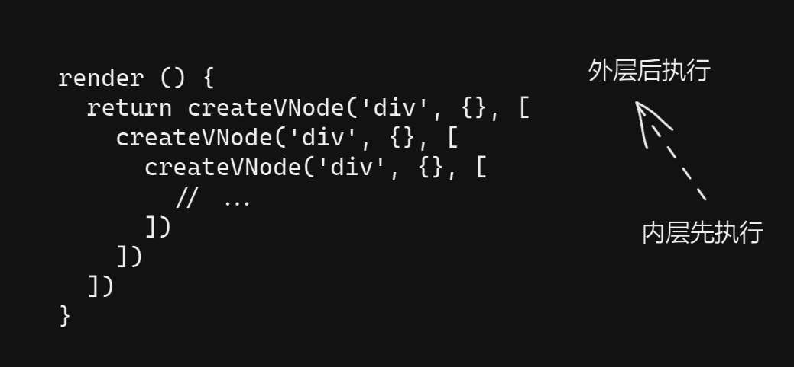

# 编译优化

编译优化指的是编译器将模板编译为渲染函数的过程中，尽可能地提取关键信息，并以此指导生成最优代码的过程。编译优化的策略与具体的实现是由框架的设计思路所决定的，不同的框架具有不同的设计思路，因此编译做优化的策略也不尽相同。但优化的方向基本一致，即尽可能地区分动态内容和静态内容，并针对不同的内容采用不同的优化策略。

## 动态节点收集与补丁标志

### 传统 Diff 算法的问题

我们之前讲解渲染器的时候，介绍了三种关于传统虚拟 DOM 的 Diff 算法。但无论哪一种，当它在比对新旧两棵虚拟 DOM 树的时候，总是要按照虚拟 DOM 的层级结构 “一层一层” 地遍历。举个例子，假设我们有如下模板：

```html
<div id="foo">
  <p class="bar">{{ text }}</p>
</div>
```

在上面这段模板中，唯一可能变化的就是 p 标签的文本子节点的内。也就是说，当响应式数据 text 的值发生变化时，最高效的更新方式就是直接设置 p 标签的文本内容。但传统 Diff 算法显然做不到如此高效，当响应式数据 text 发生变化时，会产生一棵新的虚拟 DOM 树，传统 Diff 算法对比新旧两棵虚拟 DOM 树的过程如下：

+ 对比 div 节点，以及该节点的属性和子节点；
+ 对比 p 节点，以及该节点的属性和子节点；
+ 对比 p 节点的文本子节点，如果文本子节点的内容变了，则更新，否则什么都不做。

可以看到，与直接更新 p 标签的文本内容相比，传统 Diff 算法存在很多无意义的比对操作。如果能够跳过这些无意义的操作，性能将会大幅提升。而这就是 vue.js 3 编译优化的思路来源。

实际上，模板的结构非常稳定。通过编译手段，我们可以分析出很多关键信息，例如哪些节点是静态的，哪些节点是动态的。结合这些关键信息，编译器可以直接生成原生 DOM 操作的代码，这样甚至能够抛掉虚拟 DOM，从而避免虚拟 DOM 带来的性能开销。但是，考虑到渲染函数的灵活性，以及 Vue.js 2 的兼容问题，Vue.js 3 最终还是选择了保留虚拟 DOM。这样一来，就必然要面临它所带来的额外性能开销。

那么，为什么虚拟 DOM 会产生额外的性能开销呢？根本原因在于，渲染器在运行时得不到足够的信息。传统 Diff 算法无法利用编译时提取到的任何关键信息，这导致渲染器在运行不可能去做相关的优化。而 Vue.js 3 的编译器会将编译时得到的关键信息 “附着” 在它生成的虚拟 DOM 上，这些信息会通过虚拟 DOM 传递给渲染器。最终，渲染器会根据这些关键信息执行 “快捷路径”，从而提升运行时的性能。

### Block 与 PatchFlags

之所以说传统 Diff 算法无法避免新旧虚拟 DOM 树间无用的比较操作，是因为它在运行时得不到足够的关键信息，从而无法区分动态内容和静态内容。换句话说，只要运行时能够区分动态内容和静态内容，即可实现极致的优化策略。假设我们有如下模板：

```html
<div>
  <div>foo</div>
  <p>{{ bar }}</p>
</div>
```

在上面这段模板中，只有 `{{ bar }}` 是动态的内容。因此，在理想情况下，当响应式数据 bar 的值变化时，只需要更新 p 标签的文本节点即可。为了实现这个目标，我们需要提供更多信息给运行时，这需要我们从虚拟 DOM 的结构入手。来看一下传统的虚拟 DOM 是如何描述上面那段模板的：

```js
const vnode = {
  tag: 'div',
  children: [
    { tag: 'div', children: 'foo' },
    { tag: 'p', children: ctx.bar }
  ]
}
```

传统的虚拟 DOM 中没有任何标志能够体现出节点的动态性。但经过编译优化之后，编译器会将它提取到的关键信息 “附着” 到虚拟 DOM 节点上，如下面的代码所示：

```js
const vnode = {
  tag: 'div',
  children: [
    { tag: 'div', children: 'foo' },
    { tag: 'p', children: ctx.bar, patchFlag: 1 } // 这是动态节点
  ]
}
```

可以看到，用来描述 p 标签的虚拟节点拥有一个额外的属性，即 `patchFlag`，它的值是一个数字，只要虚拟节点存在该属性，我们就认为它是一个动态节点。这里的 `patchFlag` 属性就是所谓的补丁标志。

我们可以把补丁标志理解为一系列的数字标记，并根据数字值的不同赋予它不同的含义，示例如下：

+ 数字 1：代表节点有动态的 textContent；
+ 数字2：代表元素有动态的 class 绑定；
+ 数字3：代表元素有动态的 style 绑定；
+ 数字4：...。

通常，我们会在运行时的代码中定义补丁标志的映射，例如：

```js
const PatchFlags = {
  TEXT: 1, // 节点有动态的 textContent
  CLASS: 2, // 元素有动态的 class 绑定
  STYLE: 3,
  // ...
}
```

有了这项信息，我们就可以在虚拟节点的创建阶段，把它的动态子节点提取出来，并将其存储到该虚拟节点的 `dynamicChildren` 数组内：

```js
const vnode = {
  tag: 'div',
  children: [
    { tag: 'div', children: 'foo' },
    { tag: 'p', children: ctx.bar, patchFlag: 1 } // 这是动态节点
  ],
  // 将 children 中的动态节点提取到 dynamicChildren 数组中
  dynamicChildren: [
    // p 标签具有 patchFlag 属性，因此它是一个动态节点
    { tag: 'p', children: ctx.bar, patchFlag: PatchFlags.TEXT } // 这是动态节点
  ]
}
```

观察上面的 vnode 对象可以发现，与普通虚拟节点相比，它多出了一个额外的 `dynamicChildren` 属性。我们把带有该属性的虚拟节点称为 “Block(块)”。所以，一个 Block 本质上也是一个虚拟 DOM 节点，只不过它比普通的虚拟节点多出来一个用来存储动态子节点的 `dynamicChildren` 属性。这里需要注意的是，一个 Block 不仅能够收集它的直接动态子节点，还能够收集所有动态**子代节点**。举个例子，假设我们有如下模板：

```html
<div>
  <div>
    <p>{{ bar }}</p>
  </div>
</div>
```

在这段模板中，p 标签并不是最外层 div 的直接子节点，而是它的子代节点。因此，最外层的 div 标签对应的 Block 能够将 p 标签收集到其 `dynamicChildren` 数组中，如下面的代码所示：

```js
const vnode = {
	tag: 'div',
  children: [
    {
      tag: 'div',
      children: [
        { tag: 'p', children: ctx.bar, patchFlag: PatchFlags.TEXT }
      ]
    }
  ],
  dynamicChildren: [
    // Block 可以收集所有动态子代节点
    { tag: 'p', children: ctx.bar, patchFlag: PatchFlags.TEXT }
  ]
}
```

有了 Block 这个概念之后，渲染器的更新操作将会以 Block 为维度。也就是说，当渲染器在更新一个 Block 时，会忽略虚拟节点的 `children` 数组，而是直接找到该虚拟节点的 `dynamicChildren` 数组，并只更新该数组中的动态节点。这样，在更新时就实现了跳过静态内容，只更新动态内容。同时，由于动态节点中存在对应的补丁标志，所以在更新动态节点的时候，也能够做到靶向更新。

即然 Block 的好处这么多，那么什么情况下需要将一个普通的虚拟节点变成 Block 节点呢？实际上，当我们在编写模板代码的时候，所有的根节点都会是一个 Block 节点，如下面的代码所示：

```vue
<template>
	<!-- 这个 div 标签是一个 Block -->
	<div>
    <!-- 这个 p 标签不是一个 Block，因为它不是根节点 -->
    <p>{{ bar }}</p>
  </div>
	<!-- 这个 h1 标签是一个 Block -->
	<h1>
    <!-- 这个 span 标签不是 Block，因为它不是根节点 -->
    <span :id="dynamicId"></span>
  </h1>
</template>
```

实际上，除了模板中的根节点需要作为 Block 角色之后，任何带有 `v-for`、`v-if/v-esle-if/v-else` 等指令的节点都需要作为 Block 节点，我们会在后文详细讨论。

### 收集动态节点

在编译器生成的渲染函数代码中，并不会直接包含用来描述虚拟节点的数据结构，而是包含着用来创建虚拟 DOM 节点的辅助函数，如下面的代码所示：

```js
render () {
  return createVNode('div', { id: 'foo' }, [
    createVNode('p', null, 'text')
  ])
}
```

其中 `createVNode()` 函数就是用来创建虚拟 DOM 节点的辅助函数，它的基本实现类似于：

```js
function createVNode (tag, props, children) {
  const key = props && props.key
  props && delete props.key
  
  return {
    tag,
    props,
    children,
    key
  }
}
```

可以看到，`createVNode()` 函数的返回值是一个虚拟 DOM 节点。在 `createVNode()` 函数内部，通常还会对 props 和 children 做一些额外的处理工作。

编译器在优化阶段提取的关键信息会影响最终生成的代码，具体体现在用于创建虚拟 DOM 的辅助函数上。假设我们有如下模板：

```html
<div id="foo">
  <p class="bar">{{ text }}</p>
</div>
```

编译器在对这段模板进行编译优化后，会生成带有**补丁标志（patch flag）**的渲染函数，如下代码所示：

```js
render () {
  return createVNode('div', { id: 'foo' }, [
    createVNode('p', { class: 'bar' }, text, PatchFlags.TEXT) // PatchFlags.TEXT 就是补丁标记
  ])
}
```

在上段这段代码中，用于创建 p 标签的 `createVNode()` 函数调用存在第四个参数，即 `PatchFlags.TEXT`。这个参数就是所谓的补丁标志，它代表当前虚拟 DOM 节点是一个动态节点，并且动态因素是：具有动态的文本子节点。这样就实现了对动态节点的标记。

下一步我们要思考的是如何将根节点变成一个 Block，以及如何将动态子代节点收集到该 Block 的 `dynamicChildren` 数组中。这里有一个重要的事实，即在渲染函数内，对 `createVNode()` 函数的调用是层层的嵌套结构，并且该函数的执行顺序是 “内层先执行，外层后执行”，如下图所示：



当外层 `createVNode()` 函数执行时，内层的 `createVNode()` 函数已经执行完毕了。因此，为了让外层 Block 节点能够收集到内层动态节点，就需要一个栈结构的数据来临时存储内层的动态节点，如下面的代码所示：

```js
// 动态节点栈
const dynamicChildrenStack = []
// 当前动态节点集合
let currentDynamicChildren = null
// 用来创建一个新的动态节点集合，并将该集合压入栈中
function openBlock () {
  dynamicChildrenStack.push((currentDynamicChildren = []))
}
// 用来将通过 openBlock 创建的动态节点集合从栈中弹出
function closeBlock () {
  currentDynamicChildren = dynamicChildrenStack.pop()
}
```

接着，我们还需要调用 `createVNode()` 函数，如下面的代码所示：

```js
function createVNode (tag, props, children, flags) {
  const key = props && props.key
  props && delete props.key
  
  const vnode = {
    tag,
    props,
    children,
    key,
    patchFlags: flags
  }

  if (typeof flags !== undefined && currentDynamicChildren) {
    // 动态节点，将其添加到当前动态节点集合中
    currentDynamicChildren.push(vnode)
  }

  return vnode
}
```

最后，我们需要重新设计渲染函数的执行方式，如下面的代码所示：

```js
render () {
  // 1. 使用 createBlock 代替 createVNode 来创建 block
  // 2. 每当调用 createBlock 之前，先调用 openBlock
  return (openBlock(), createBlock('div', null, [
    createVNode('p', { class: 'foo' }, null, 1 /* patch flag */),
    createVNode('p', { class: 'bar' }, null)
  ]))
}

function createBlock (tag, props, children) {
  // block 本质也是一个 vnode
  const block = createVNode(tag, props, children)
  // 将当前动态节点集合作为 block.dynamicChildren
  block.dynamicChildren = currentDynamicChildren

  // 关闭 block
  closeBlock()

  return block
}
```

### 渲染器的运行时支持

现在，我们已经有了动态节点集合 `vnode.dynamicChildren`，以及附着其上的补丁标志。基于这两点，即可在渲染器中实现靶向更新。

回顾一个传统的节点更新方式，如下面的 `patchElement()` 函数所示，它取自之前讲解的渲染器：

```js
function patchElement (n1, n2) {
  const el = n2.el = n1.el
  const oldProps = n1.props
  const newProps = n2.props

  // 第一步：更新 props
  for (const key in newProps) {
    if (newProps[key] !== oldProps[key]) {
      patchProps(el, key, oldProps[key], newProps[key])
    }
  }
  for (const key in oldProps) {
    if (!key in newProps) {
      patchProps(el, key, oldProps[key], null)
    }
  }

  // 第二步：更新 children
  patchChildren(n1, n2, el)
}
```

由上面的代码可知，渲染器在更新标签节点时，使用 `patchElement()` 函数来更新标签的子节点。但该函数会使用传统虚拟 DOM 的 Diff 算法进行更新，这样做效率比较低。有了 `dynamicChildren` 之后，我们可以直接对比动态节点，如下面的代码所示：

```js
function patchElement (n1, n2) {
  const el = n2.el = n1.el
  const oldProps = n1.props
  const newProps = n2.props

  // ...

  // 第二步：更新 children
  if (n2.dynamicChildren) {
    // 调用 patchBlockChildren 函数，这样只会更新动态节点
    patchBlockChildren(n1, n2)
  } else {
    patchChildren(n1, n2, el)
  }
}

function patchBlockChildren (n1, n2) {
  // 只更新动态节点即可
  for (let i = 0; i < n2.dynamicChildren.length; i++) {
    patchElement(n1.dynamicChildren[i], n2.dynamicChildren[i])
  }
}
```

这样，渲染器只会更新动态节点，而跳过所有静态节点。

动态节点集合能够使得渲染器在执行更新时跳过静态节点，但对于单个动态节点的更新来说。由于它存在对应的补丁标志，因此我们可以针对性地完成靶向更新，如下面的代码所示：

```js
function patchElement (n1, n2) {
  const el = n2.el = n1.el
  const oldProps = n1.props
  const newProps = n2.props

  if (n2.patchFlags) {
    // 靶向更新
    if (n2.patchFlags === PatchFlags.CLASS) {
      // 只需要更新 class
    } else if (n2.patchFlags === PatchFlags.STYLE) {
      // 只需要更新 style
    }
    // ...
  } else {
    for (const key in newProps) {
      if (newProps[key] !== oldProps[key]) {
        patchProps(el, key, oldProps[key], newProps[key])
      }
    }
    for (const key in oldProps) {
      if (!key in newProps) {
        patchProps(el, key, oldProps[key], null)
      }
    }
  }

  if (n2.dynamicChildren) {
    patchBlockChildren(n1, n2)
  } else {
    patchChildren(n1, n2, el)
  }
}
```

## Block 树

前文我们约定了组件模板的根节点必须作为 Block 角色。这样，从根节点开始，所有动态子代节点都会被收集到根节点的 `dynamicChildren` 数组中。但是，如果只有根节点是 Block 角色，是不会形成 Block 树的。既然要形成 Block 树，那就意味着除了根节点之外，还会有其他的特殊节点充当 Block 角色。实际上，带有结构化指令的节点，如 `v-if`、`v-for` 指令的节点，都应作为 Block 角色。接下来，我们就详细讨论原因。

### 带有 v-if 指令的节点

首先，我们来看下面的这段模板：

```html
<div>
  <section v-if="foo">
    <p>{{ a }}</p>
  </section>
  <div v-else>
    <p>{{ a }}</p>
  </div>
</div>
```

假设只有最外层的 div 标签会作为 Block 角色。那么，当变量 foo 的值为 true 时，block 收集到的动态节点是：

```js
const block = {
  tag: 'div',
  dynamicChildren: [
    { tag: 'p', children: ctx.a, patchFlags: PatchFlags.TEXT }
  ],
  // ...
}
```

而当变量 foo 的值为 false 时，block 收集到的动态节点是：

```js
const block = {
  tag: 'div',
  dynamicChildren: [
    { tag: 'p', children: ctx.a, patchFlags: PatchFlags.TEXT }
  ],
  // ...
}
```

可以发现，无论变量 foo 的值是 true 还是 false，block 所收集的动态节点是不变的。这意味着，在 Diff 阶段不会做任何更新。但是我们也看到了，在上面的模板中，带有 v-if 指令的是 `<section>` 标签，而带有 v-else 指令的是 `<div>` 标签。很明显，更新前后的标签不同，如果不做任何更新，将产生严重的 bug。不仅如此，下面的模板也会出现同样的问题：

```html
<div>
  <section v-if="foo">
    <p>{{ a }}</p>
  </section>
  <section v-else><!-- 即使这里是 section -->
    <div><!-- 这个 div 标签会在 Diff 过程中被忽略 --></div>
    <p>{{ a }}</p>
  </section>
</div>
```

在上面这段模板中，即使带有 v-if 和 v-else 的标签都是 `<section>` 标签，但由于两个分支上虚拟 DOM 树的结构不同，仍然会导致更新失败。

实际上，上述问题的根本原因在于，`dynamicChildren` 数组中收集的动态节点是忽略虚拟 DOM 树层级的。换句话说，结构化指令会导致更新前后模板的结构发生变化，即模板结构不稳定。那么，如何让虚拟 DOM 树的结构变稳定呢？其实很简单，只需要让带有 `v-if/v-else-if/v-else` 等结构化的节点也作为 Block 角色即可。

以上面的模板为例，如果上面这段模板中的两个 `<section>` 标签都作为 Block 角色，那么将构成一棵 Block 树：

```
Block(div)
	- Block(Section v-if)
	- Block(Section v-else)
```

父级 Block 除了会收集动态子代节点之外，也会收集子 Block。因此，两个子 Block(section) 将作为父级 Block(div) 的动态节点被收集到父级 Block(div) 的 `dynamicChildren` 数组中，如下面的代码所示：

```js
const block = {
  tag: 'div',
  dynamicChildren: [
    // Block(section v-if) 或 Block(section v-else)
    { tag: 'section', { key: 0 /* key 值会根据不同的 Block 而发生变化 */ }, dynamicChildren: [...] } 
  ]
}
```

这样，当 v-if 条件为真时，父级 Block 的 `dynamicChildren` 数组中包含的是 Block(section v-if)；当 v-if 条件为假时，父级 Block 的 `dynamicChildren` 数组中包含的是 Block(section v-else)。在 Diff 过程中，渲染器能够根据 Block 的 key 值区分出更新前后的两个 Block 是不同的，并使用新的 Block 替换旧的 Block。这样就解决了 DOM 结构不稳定引起的更新问题。

### 带有 v-for 指令的节点

不仅带有 v-if 指令的节点会让虚拟 DOM 树的结构不稳定，带有 v-for 指令的节点也会让虚拟 DOM 树变得不稳定，并且情况会稍微复杂一些。

思考如下模板：

```html
<div>
  <p v-for="item in list">
    {{ item }}
  </p>
  <i>{{ foo }}</i>
  <i>{{ bar }}</i>
</div>
```

假设 list 是一个数组，在更新过程中，list 数组的值由 `[1, 2]` 变为 `[1]`。按照之前的思路，即只有根节点会作为 Block 角色，那么，上面的模板中，只有最外层的 `<div>` 标签会作为 Block。所以，这段模板在更新前后对应的 Block 树是：

```js
// 更新前
const prevBlock = {
  tag: 'div',
  dynamicChildren: [
    { tag: 'p', children: 1, PatchFlags.TEXT },
    { tag: 'p', children: 2, PatchFlags.TEXT },
    { tag: 'i', children: ctx.foo, PatchFlags.TEXT },
    { tag: 'i', children: ctx.bar, PatchFlags.TEXT },
  ]
}

// 更新后
const nextBlock = {
  tag: 'div',
  dynamicChildren: [
    { tag: 'p', children: 1, PatchFlags.TEXT },
    { tag: 'i', children: ctx.foo, PatchFlags.TEXT },
    { tag: 'i', children: ctx.bar, PatchFlags.TEXT },
  ]
}
```

观察上面这段代码，更新前的 Block 树中有四个动态节点，而更新后的 Block 树只有三个动态节点。这时要如何进行 Diff 操作呢？有人可能会说，使用更新前后的两个 `dynamicChildren` 数组内的节点进行传统 Diff 不就可以了吗？这样做显然是不对的，因为传统 Diff 的一个非常重要的前置条件是：进行 Diff 操作的节点必须是同层级节点。但是 `dynamicChildren` 数组内的节点未必是同层级的，这一点我们在之前也提到过。

实际上，解决方法很简单，我们只需要让带有 v-for 指令的标签也作为 Block 角色即可。这样就能够保证虚拟 DOM 具有稳定的结构，即无论 v-for 在运行时怎样变化，这棵 Block 树看上去都是一样的，如下面的代码所示：

```js
const nextBlock = {
  tag: 'div',
  dynamicChildren: [
    // 这是一个 Block，它有 dynamicChildren
    { tag: Fragment, dynamicChildren: [/* v-for 的节点 */] },
    { tag: 'i', children: ctx.foo, PatchFlags.TEXT },
    { tag: 'i', children: ctx.bar, PatchFlags.TEXT },
  ]
}
```

由于 v-for 指令渲染的是一个片段，所以我们需要使用类型为 Fragment 的节点来表达 v-for 指令的渲染结果，并作为 Block 角色。

### Fragment 的稳定性

我们需要仔细研究 Fragment 节点本身。

给出下面这段模板：

```html
<p v-for="item in list">
  {{ item }}
</p>
```

当 list 数组由 `[1, 2]` 变成 `[1]` 时，Fragment 节点在更新前后对应的内容分别是：

```js
// 更新前
const prevBlock = {
  tag: Fragment,
  dynamicChildren: [
    { tag: 'p', children: 1, PatchFlags.TEXT },
    { tag: 'p', children: 2, PatchFlags.TEXT }
  ]
}

// 更新后
const nextBlock = {
  tag: Fragment,
  dynamicChildren: [
    { tag: 'p', children: 1, PatchFlags.TEXT }
  ]
}
```

我们发现，Fragment 本身收集的动态节点仍然面临结构不稳定的情况。**所谓结构不稳定，从结果上看，指的是更新前后一个 block 的 `dynamicChildren` 数组中收集的动态节点的数量或顺序不一致。**这种不一致导致我们无法进行靶向更新，怎么办呢？其实对于这种情况，没有更好的解决办法，我们只能放弃根据 `dynamicChildren` 数组中的动态节点进行靶向更新的思路，并回退到传统虚拟 DOM 的 Diff 手段，即直接使用 Fragment 的 children 而非 `dynamicChildren` 进行 Diff 操作。但需要注意的是，Fragment 的子节点（children）仍然可以是由 Block 组成的数组，例如：

```js
const block = {
  tag: Fragment,
  children: [
    { tag: 'p', children: 1, PatchFlags.TEXT },
    { tag: 'p', children: 2, PatchFlags.TEXT }
  ]
}
```

这样，当 Fragment 的子节点进行更新时，就可以恢复优化模式。

既然有不稳定的 Fragment，那就有稳定的 Fragment。那么什样的 Fragment 是稳定的呢？有以下几种情况：

1. v-for 指令的表达式是常量：

   ```html
   <p v-for="n in 10"></p>
   <!-- 或者 -->
   <p v-for="n in 'abc'"></p>
   ```

   由于表达式 10 和 'abc' 是常量，所以无论怎样更新，上面两个 Fragment 都不会变化。因此，这两个 Fragment 是稳定的。对于稳定的 Fragment，我们不需要回退到传统 Diff 操作，这在性能上会有一定的优势；

2. 模板中有多个根节点。Vue.js 3 不再限制组件的模板必须有且只有一个根节点。当模板中存在多个根节点时，我们需要使用 Fragment 来描述它。例如：

   ```vue
   <template>
     <div></div>
     <p></p>
     <i></i>
   </template>
   ```

同时，用于描述具有多个根节点的模板的 Fragment 也是稳定的。

## 静态提升

理解了 Block 树之后，我们再来看看其他方面的优化，其中之一就是静态提升。它能够减少更新时创建虚拟 DOM 带来的性能开销和内存占用。

假设我们有如下模板：

```html
<div>
  <p>static text</p>
  <p>{{ title }}</p>
</div>
```

在没有静态提升的情况下，它对应的渲染函数是：

```js
function render () {
  return (openBlock(), createBlock('div', null, [
    createVNode('p', null, 'static text'),
    createVNode('p', null, ctx.title, 1 /* TEXT */),
  ]))
}
```

可以看到，在这段虚拟 DOM 的描述中存在两个 p 标签，一个是纯静态的，而另一个是拥有动态文本。当响应式数据 title 的值发生变化时，整个渲染函数会重新执行，并产生新的虚拟 DOM 树。这个过程有一个很明显的问题，即纯静态的虚拟节点在更新时也会被重新创建一次。很显然，这是没有必要的，所以我们需要想办法避免由此带来的性能开销。而解决方案就是所谓的 “静态提升”，即把纯静态的节点提升到渲染函数之外，如下面的代码所示：

```js
// 把静态节点提升到渲染函数之外
const hoist1 = createVNode('p', null, 'static text')

function render () {
  return (openBlock(), createBlock('div', null, [
    hoist1, // 静态节点引用
    createVNode('p', null, ctx.title, 1 /* TEXT */),
  ]))
}
```

可以看到，当把纯静态的节点提升到渲染函数之外后，在渲染函数内只会持有对静态节点的引用。当响应式数据变化，并使得渲染函数重新执行时，并不会重新创建静态的虚拟节点，从而避免了额外的性能开销。

需要强调的是，静态提升是以树为单位的。以下面的模板为例：

```html
<div>
  <section>
  	<p>
      <span>abc</span>
    </p>
  </section>
</div>
```

在上面这段模板中，除了根节点的 div 标签会作为 Block 角色而不可被提升之外，整个 `<section>` 元素及其子代节点都都会被提升。如果我们把上面模板中的静态字符串 abc 换成动态绑定的 `{{ abc }}`，那么整棵树都不会被提升。

虽然包含动态绑定的节点本身不会被提升，但该动态节点上仍然可能存在纯静态的属性，如下面的模板所示：

```html
<div>
  <p foo="bar" a=b>{{ text }}</p>
</div>
```

在上面这段模板中，p 标签存在动态绑定的文本内容，因此整个节点都不会被静态提升，但该节点的所有 props 都是静态的，因此在最终生成渲染函数时，我们可以将纯静态的 props 提升到渲染之外，如下面的代码所示：

```js
// 静态提升的 props 对象
const hoistProp = { foo: 'bar', a: 'b' }

function render () {
  return (openBlock(), createBlock('div', null, [
    createVNode('p', hoistProp, ctx.text, 1 /* TEXT */),
  ]))
}
```

这样做同样可以减少创建虚拟 DOM 产生的开销以及内存占用。

## 预字符串化

基于静态提升，我们还可以进一步采用预字符串化的优化手段。预字符串化是基于静态提升的一种优化策略。静态提升的虚拟节点或虚拟节点树本身是静态的，那么，能否将其预字符串化呢？如下面的模板所示：

```html
<div>
  <p></p>
  <p></p>
  <!-- ... 20 个 p 标签 -->
  <p></p>
</div>
```

假设上面的模板中包含大量连续纯静态的标签节点，当采用了静态提升优化策略时，其编译后的代码如下：

```js
const hoist1 = createVNode('p', null, null, PatchFlags.HOISTED)
const hoist2 = createVNode('p', null, null, PatchFlags.HOISTED)
// ...
const hoist20 = createVNode('p', null, null, PatchFlags.HOISTED)

render () {
  return (openBlock(), createBlock('div', null, [
    hoist1,
    hoist2,
    ...
    hoist20
  ]))
}
```

预字符串化能够将这些静态节点序列化为字符串，并生成一个 Static 类型的 VNode：

```js
const hoistStatic = createStaticVNode('<p></p><p></p><p></p>...<p></p>')

render () {
  return (openBlock(), createBlock('div', null, [
    hoistStatic
  ]))
}
```

这么做有几个明显的优势：

1. 大块的静态内容可以通过 innerHTML 进行设置，在性能上具有一定优势；
2. 减少创建虚拟节点产生的性能开销；
3. 减少内存占用。

## 缓存内联事件处理函数

提到优化，就不得不提对内联事件处理函数的缓存。缓存内联事件处理函数可以避免不必要的更新。假设模板内容如下：

```html
<Comp @change="a + b" />
```

上面这段模板展示的是一个绑定了 change 事件的组件，并且为 change 事件绑定的事件处理程序是一个内联语句。对于这样的模板，编译器会为其创建一个内联事件处理函数，如下面的代码所示：

```js
function render (ctx) {
  return h(Comp, {
    // 内联事件处理函数
    onChange: () => (ctx.a + ctx.b)
  })
}
```

很显然，每次重新渲染时，都会为 Comp 组件创建一个全新的 props 对象。同时，props 对象中的 onChange 属性的值也会是全新的函数。这会导致渲染器对 Comp 组件进行更新时造成额外的性能开销。为了避免这类无用的更新，我们需要对内联事件处理函数进行缓存，如下面代码所示：

```js
function render (ctx, cache) {
  return h(Comp, {
    // 将内联事件处理函数缓存到 cache 数组中
    onChange: cache[0] || (cache[0] = ($event) => (ctx.a + ctx.b))
  })
}
```

渲染函数的第二个参数是一个数组 cache，该数组来自组件实例，我们可以把内联事件处理函数添加到 cache 数组中。这样，当渲染函数重新执行并创建新的虚拟 DOM 树时，会优先读取缓存中的事件处理函数。这样，无论执行多少次渲染函数，props 对象中 onChange 属性的值始终不变，于是就不会触发 Comp 组件更新了。

## v-once

Vue.js 3 不仅会缓存内联事件处理函数，配合 v-once 还可以实现对虚拟 DOM 的缓存。Vue.js 2 也支持 v-once 指令，当编译器遇到 v-once 指令时，会利用我们上面介绍的 cache 数组来缓存渲染函数的全部或者部分执行结果，如下面的模板所示：

```html
<section>
	<div v-once>
    {{ foo }}
  </div>
</section>
```

在上面这段模板中，div 标签存在动态绑定的文本内容。但是它被 v-once 指令标记，所以这段模板会被编译为：

```js
function render (ctx, cache) {
  return (openBlock(), createBlock('section', null, [
    cache[1] || (cache[1] = createVNode('div', null, ctx.foo, 1 /* TEXT */))
  ]))
}
```

从编译结果中可以看到，该 div 标签对应的虚拟节点被缓存到了 cache 数组中。既然虚拟节点已经被缓存了，那么后续更新导致该渲染函数重新执行时，会优先读取缓存的内容，而不会重新创建虚拟节点。同时，由于虚拟节点被缓存，意味着更新前后的虚拟节点不会发生变化，因此也就不需要这些被缓存的虚拟节点参与 Diff 操作了。所以在实际编译后的代码中经常出现下面这段内容：

```js
render (ctx, cache) {
 return (openBlock(), createBlock('div', null, [
   cache[1] || (
     setBlockTracking(-1), // 阻止这段 Vnode 被 Block 收集
     cache[1] = h('div', null, ctx.foo, 1 /* TEXT */),
     setBlockTracking(1), // 恢复
     cache[1]
   )
 ])) 
}
```

注意上面这段代码中的 `setBlockTracking(-1)` 函数的调用，它用来暂停动态节点的收集。换句话说，使用 v-once 包裹的动态节点不会被父级 Block 收集。因此，被 v-once 包裹的动态节点在组件更新时，自然不会参与 Diff 操作。

v-once 指令通常用于不会发生改变的动态绑定中，例如绑定一个常量：

```html
<div>{{ SOME_CONSTANT }}</div>
```

为了提升性能，我们可以使用 v-once 来标记这段内容：

```html
<div v-once>{{ SOME_CONSTANT }}</div>
```

这样，在组件更新时就会跳过这段内容的更新，从而提升更新性能。

实际上，v-once 指令能够从两个方面提升性能：

1. 避免组件更新时重新创建虚拟 DOM 带来的性能开销。因为虚拟 DOM 被缓存了，所以更新时无须重新创建；
2. 避免无用的 Diff 开销。这是因为被 v-once 标记的虚拟 DOM 树不会被父级 Block 节点收集。

## 🚀 章节链接

- 上一章：[解析器](https://github.com/humandetail/VueJS-design-and-implementation/blob/master/notes/15.%E8%A7%A3%E6%9E%90%E5%99%A8.md)

- 下一章: [同构渲染](https://github.com/humandetail/VueJS-design-and-implementation/blob/master/notes/17.%E5%90%8C%E6%9E%84%E6%B8%B2%E6%9F%93.md)