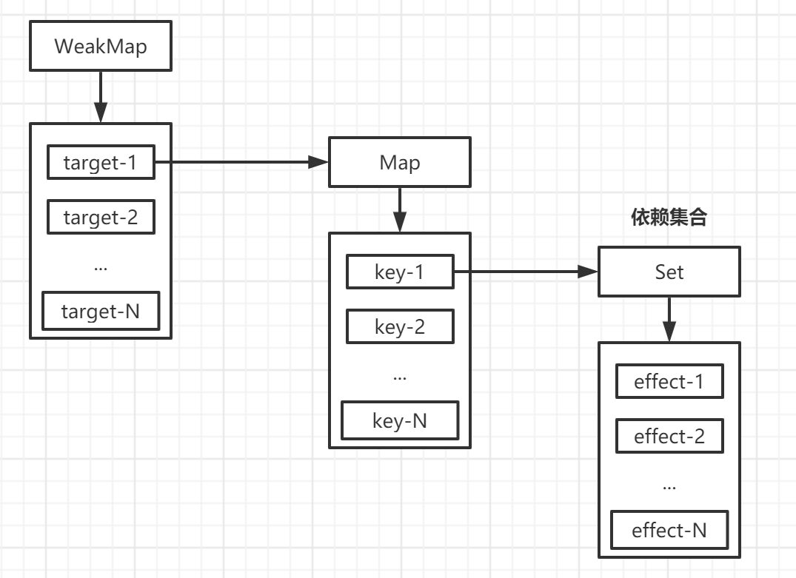

# 响应系统的作用与实现

## 响应式数据与副作用函数

一切非纯函数（同样的输入对应同样的输出）都是有副作用的函数，也就是说副作用函数内部会直接或间接地影响到外部变量或函数。副作用函数很容易产生：

```js
function effect () {
  document.body.textContent = 'Hello world.'
}
```

当 `effect()` 函数执行时，会改变 document.body 的文本内容，但是 document.body 也可以被 `effect()` 函数之外的任意函数读取或设置。

一个函数修改了全局变量，这也是一个副作用：

```js
let a = 1

function effect () {
  a = 2
}
```

什么是响应式数据？

```js
const obj = { text: 'Hello world.' }

function effect () {
  document.body.textContent = obj.text
}
```

如上面的代码所示：`effect()` 函数的执行，会设置 document.body 的 textContent 属性，其值为 obj.text，同时我们希望在 obj.text 的值发生变化时，会重新执行 `effect()` 函数。

如果我们能实现这个目标，那么 obj 就可以称为响应式数据。

显然，上面的代码无法实现这一点，因为 obj 只是一个普通的对象。

## 响应式数据的基本实现

通过上面的观察，我们发现：

1. 当 `effect()` 函数执行时，会触发 obj.text 的**读取操作**；
2. 当修改 obj.text 的值时，会触发 obj.text 的**设置操作**。

如果我们能在 obj.text 的读取和设置时做一个拦截，事情就变得简单了：当 obj.text 被读取时，我们可以把副作用函数 `effect()` 存储到一个“桶”（bucket）中；

当设置 obj.text 的值时，再从 bucket 中取出副作用函数 `effect()` 执行即可。

我们采用 Proxy 来实现这一功能：

```js
// 存储副作用的“桶”
const bucket = new Set()

// 原始数据
const data = { text: 'Hello world.' }
// 对原始数据进行代理
const obj = new Proxy(data, {
  // 拦截读取操作
  get (target, key) {
    // 将副作用函数加入 bucket 中
    bucket.add(effect)
    // 返回属性值
    return target[key]
  },

  // 拦截设置操作
  set (target, key, value) {
    // 设置属性值
    target[key] = value
    // 把副作用函数从 bucket 中取出并执行
    bucket.forEach(fn => fn())
    // 返回 true 表示设置操作成功
    return true
  }
})
```

我们用下面的代码来测试一下：

```js
function effect () {
  document.querySelector('#root').textContent = obj.text
}

effect()

setTimeout(() => {
  obj.text = 'Hello vue.'
}, 1000)
```

在浏览器中运行上面的代码，会得到期望的结果。

## 设计一个完善的响应系统

此前，我们设计了一个微型的响应系统，它还不完善，所以我们需要进一步来完善它。

在上面的实现中，我们在代码中写死了了副作用函数的名称（effect），如果我们的副作用函数名称不叫 effect，那么我们整响应式系统就会失效。

所以我们希望，哪怕副作用函数是一个匿名函数，也能被正确地收集到 bucket 中。为了实现这一点，我们需要提供一个用来注册副作用函数的机制：

```js
// 用一个全局变量来存储被注册的副作用函数
let activeEffect

// effect 函数用来注册副作用函数
function effect (fn) {
  // 当调用 effect() 函数时，将副作用函数 fn() 赋值给 activeEffect
  activeEffect = fn
  // 执行副作用函数
  fn()
}
```

那么我们就可以使用 `effect()` 函数来注册一个副作用函数：

```js
effect(
  // 一个匿名的副作用函数
  () => {
    document.querySelector('#root').textContent = obj.text
  }
)
```

我们的响应式系统也需要进行一些修改：

```js
const obj = new Proxy(data, {
  // 拦截读取操作
  get (target, key) {
    // 将 activeEffect 中存储的副作用函数加入 bucket 中
    if (activeEffect) {
      bucket.add(activeEffect)
    }
    // 返回属性值
    return target[key]
  },

  // 拦截设置操作
  set (target, key, value) {
    // 设置属性值
    target[key] = value
    // 把副作用函数从 bucket 中取出并执行
    bucket.forEach(fn => fn())
    // 返回 true 表示设置操作成功
    return true
  }
})
```

这样子，响应式系统就不再依赖副作用函数的名称了。

但是，如果我们在 obj 上设置一个不存在的属性时：

```js
effect(
  // 副作用函数
  () => {
    console.log('effect run.') // 会执行两次
    document.querySelector('#root').textContent = obj.text
  }
)

setTimeout(() => {
  obj.notExist = 'Hello vue.'
}, 1000)
```

在1秒后，我们给 obj 增加了一个新的属性，副作用函数也会执行，这是不正确的。

导致该问题的原因是，我们**没有在副作用函数与被操作的目标属性之间建立明确的关系**。无论我们设置的是什么属性，副作用函数都会被收集到 bucket 中。

而解决的方法也很简单，我们只需要把副作用函数与被操作的目录属性关联起来即可。在实现这一点之前，我们先看一下以下的代码：

```js
effect(function effectFn () {
  document.querySelector('#root').textContent = obj.text
})
```

在这段代码中，存在三个角色：

1. 被操作的对象：obj；
2. 被操作的属性：text；
3. 使用 effect 注册的副作用函数 effectFn。

如果用 target 表示被操作的对象，key 表示被操作的属性，effectFn 表示副作用函数，那么可以为这三个角色建立如下关系：

```
target
  └-- key
  		 └-- effectFn
```

一个 target 可以有多个 key；一个 key 可以有多个 effectFn；一个 effectFn 可以对应多个 key。

下面举几个粟子也说明一下各种情况：

```js
effect(function effectFn1 () {
  obj.text
})
effect(function effectFn2 () {
  obj.text
})
```

关系如下：

```
target
  └-- key
  		 └-- effectFn1
  		 └-- effectFn2
```

----

```js
effect(function effectFn () {
  obj.foo
  obj.bar
})
```

关系如下：

```
target
  └-- foo
  		 └-- effectFn
  └-- bar
  		 └-- effectFn
```

----

```js
effect(function effectFn1 () {
  obj1.foo
})
effect(function effectFn2 () {
  obj2.bar
})
```

关系如下：

```
target1
  └-- foo
  		 └-- effectFn1
target2
  └-- bar
  		 └-- effectFn2
```

针对以上的分析，我们需要重新设置响应式系统：

```js

// 存储副作用的“桶”
const bucket = new WeakMap()

// 原始数据
const data = { text: 'Hello world.' }
// 对原始数据进行代理
const obj = new Proxy(data, {
  // 拦截读取操作
  get (target, key) {
    // 如果不存在副作用函数，直接返回
    if (!activeEffect) {
      return target[key]
    }

    // 从 bucket 中取出 depsMap，它是一个 Map 类型
    let depsMap = bucket.get(target)

    if (!depsMap) {
      bucket.set(target, (depsMap = new Map()))
    }

    // 再根据 key 从 depsMap 中取出 deps，它是一个 Set 类型
    // 里面存储着所有与当前 key 相当的副作用函数
    let deps = depsMap.get(key)

    if (!deps) {
      depsMap.set(key, (deps = new Set()))
    }

    // 最后将副作用函数存储进 deps 里面
    deps.add(activeEffect)

    // 返回属性值
    return target[key]
  },

  // 拦截设置操作
  set (target, key, value) {
    // 设置属性值
    target[key] = value
    // 根据 target 从 bucket 中取出所有的 depsMap
    const depsMap = bucket.get(target)

    if (!depsMap) return true

    // 根据 key 从 depsMap 中取出所有的副作用函数
    const effects = depsMap.get(key)

    effects && effects.forEach(fn => fn())
    // 返回 true 表示设置操作成功
    return true
  }
})
```

从这段代码中可以看出构建数据结构的方式，我们分别使用了 `WeakMap`、`Map` 和 `Set`：

+ `WeapMap` 由 target -> `Map` 构成；
+ `Map` 由 key -> `Set` 构成。

它们之间的关系如下图所示：



弄清楚他们之间的关系后，我们有必要解释一下这里为什么使用 `WeakMap`，我们看下以下代码：

```js
const map = new Map()
const weakMap = new WeakMap()

;(function () {
  const foo = { foo: 1 }
  const bar = { bar: 1 }
  
  map.set(foo, 1)
  weakMap.set(bar, 1)
})()

console.log(map)
console.log(weakMap)
```

上面的代码，我们定义了 map 和 weakMap 常量，当立即执行函数（IIFE）执行完毕后，foo 仍然作为 map 的 key 被引用着，因此垃圾回收器不会把它从内存中移除，我们仍然可以通过 `map.keys()` 来获取到 foo 对象；而对于 bar 来说，由于 ` WeakMap` 的是 key 是弱引用，垃圾回收器会在表达式执行完毕后立即将对象 bar 从内存中移除，并且我们无法获取 `WeakMap` 的 key 值，也就无法通过 weakMap 来获取 bar 对象。

因为 WeakMap 的 key 是弱引用这一特性，所以我们在存储 一些只有当 key 所引用的对象存在时（没有被回收）才有价值的信息，比如上面的场景中，如果 target 对象没有任何引用了，说明用户不再需要它了，这时垃圾回收器会完成回收任务。

而如果使用 `Map` 来代替 `WeakMap` 那么即使用户的代码对 target 没有任何引用，这个 target 也不会被回收，最后可能导致内存溢出。

最后，我们对之前封装的代码作一些提取处理：把 get 拦截中的部分逻辑单独封装到一个 `track()` 函数中，track 表示追踪的意思；同样把 set 拦截中的部分逻辑单独封装到一个 `trigger()` 函数中，trigger 表示触发的意思。

```js
// 存储副作用的“桶”
const bucket = new WeakMap()

// 原始数据
const data = { text: 'Hello world.' }
// 对原始数据进行代理
const obj = new Proxy(data, {
  // 拦截读取操作
  get (target, key) {
    track(target, key)

    // 返回属性值
    return target[key]
  },

  // 拦截设置操作
  set (target, key, value) {
    // 设置属性值
    target[key] = value
    
    trigger(target, key)

    // 返回 true 表示设置操作成功
    return true
  }
})

function track (target, key) {
  // 如果不存在副作用函数，直接返回
  if (!activeEffect) return

  // 从 bucket 中取出 depsMap，它是一个 Map 类型
  let depsMap = bucket.get(target)

  if (!depsMap) {
    bucket.set(target, (depsMap = new Map()))
  }

  // 再根据 key 从 depsMap 中取出 deps，它是一个 Set 类型
  // 里面存储着所有与当前 key 相当的副作用函数
  let deps = depsMap.get(key)

  if (!deps) {
    depsMap.set(key, (deps = new Set()))
  }

  // 最后将副作用函数存储进 deps 里面
  deps.add(activeEffect)
}

function trigger (target, key) {
  // 根据 target 从 bucket 中取出所有的 depsMap
  const depsMap = bucket.get(target)

  if (!depsMap) return true

  // 根据 key 从 depsMap 中取出所有的副作用函数
  const effects = depsMap.get(key)

  effects && effects.forEach(fn => fn())
}
```

如上面的代码所示，分别把逻辑封装到 `track()` 和 `trigger()` 中，这能为我们带来极大的灵活性。

## 分支切换与 cleanup

什么是分支切换？

```js
const data = { ok: true, text: 'Hello world.' }

const obj = new Proxy(data, { /* ... */ })

effect(function effectFn () {
  document.body.textContent = obj.ok ? obj.text : 'plain text.'
})
```

在副作用函数内部存在一个三元表达式，根据 `obj.ok` 的不同会执行不同分支的代码。当 `obj.ok` 发生变化时，代码执行的分支会跟着变化，这就是所谓的分支切换。

分支切换可能会产生遗留的副作用函数。拿上面的代码为例：当 `obj.ok` 初始值为 true，那么会读取 `obj.text` 的值，也就是说会收集到 `obj.ok` 的 effectFn 和 `obj.text` 的 effectFn；

当 `obj.ok` 设置为 false 时，副作用函数重新执行后，由于 `obj.text` 不会被读取，只会触发 `obj.ok` 的读取操作，所以理想的情况下 `obj.text` 对应的 effectFn 不应该被收集。

但是根据前文的实现，暂时还做不到这一点。`obj.text` 对应的 effectFn 还是被收集起来了，当我们改变 `obj.text` 的值时，会触发更新，导致副作用函数重新运行，即使 `document.body.textContent` 的值不需要变化。这就会导致无用的更新。

解决这个问题的思路很简单：每次副作用函数执行时，我们可以先清除它关联的副作用函数。当副作用函数执行完毕后，会重新再建立关联，但在新的联系中不再包含遗留的副作用函数。

```js
// effect 函数用来注册副作用函数
function effect (fn) {
  // 当调用 effect() 函数时，将副作用函数 fn() 赋值给 activeEffect
  const effectFn = () => {
    // 当 effectFn 执行时，将其设置为当前激活的副作用函数
    activeEffect = effectFn
    fn()
  }

  // 使用 effectFn.deps 为缓存所有与该副作用函数相关联的集合
  effectFn.deps = []
  // 执行副作用函数
  effectFn()
}
```

那么 `effectFn.deps` 中的依赖集合如何收集呢？很简单，在 `track()` 函数中：

```js
function track (target, key) {
  // 如果不存在副作用函数，直接返回
  if (!activeEffect) return

  // 从 bucket 中取出 depsMap，它是一个 Map 类型
  let depsMap = bucket.get(target)

  if (!depsMap) {
    bucket.set(target, (depsMap = new Map()))
  }

  // 再根据 key 从 depsMap 中取出 deps，它是一个 Set 类型
  // 里面存储着所有与当前 key 相当的副作用函数
  let deps = depsMap.get(key)

  if (!deps) {
    depsMap.set(key, (deps = new Set()))
  }

  // 最后将副作用函数存储进 deps 里面
  deps.add(activeEffect)

  // deps 就是一个与当前副作用函数存在联系的依赖集合
  // 将其添加到 activeEffect.deps 中
  activeEffect.deps.push(deps)
}
```

有了这个联系之后，我们就可以在每次副作用函数执行时，先清除之前的联系：

```js
// effect 函数用来注册副作用函数
function effect (fn) {
  // 当调用 effect() 函数时，将副作用函数 fn() 赋值给 activeEffect
  const effectFn = () => {
    // 调用 cleanUp() 函数完成清除工作
    cleanUp(effectFn)
    // 当 effectFn 执行时，将其设置为当前激活的副作用函数
    activeEffect = effectFn
    fn()
  }

  // 使用 effectFn.deps 为缓存所有与该副作用函数相关联的集合
  effectFn.deps = []
  // 执行副作用函数
  effectFn()
}

function cleanUp (effectFn) {
  effectFn.deps.forEach(deps => {
    // 将 effectFn 从依赖集合中移除
    deps.delete(effectFn)
  })

  // 最后需要重置 effectFn.deps 数组
  effectFn.deps.length = 0
}
```

然后我们需要在 `trigger()` 里面对 `Set` 的 forEach 进行处理，防止代码进入死循环：

```js
function trigger (target, key) {
  // 根据 target 从 bucket 中取出所有的 depsMap
  const depsMap = bucket.get(target)

  if (!depsMap) return true

  // 根据 key 从 depsMap 中取出所有的副作用函数
  const effects = depsMap.get(key)

  // effects && effects.forEach(fn => fn())

  // 用一个新的 Set 来完成 forEach 操作，防止添加时进入死循环
  const effectsToRun = new Set(effects)
  effectsToRun.forEach(effectFn => effectFn())
}
```

最后我们的检验一下代码：

```js
effect(
  // 副作用函数
  () => {
    console.log('run')
    document.querySelector('#root').textContent = obj.ok ? obj.text : 'plain text.'
  }
)

setTimeout(() => {
  obj.ok = false
  setTimeout(() => {
    obj.text = 'Hello again.'
  }, 1000)
}, 1000)
```

控制台一共输出两次 run，一次是 `obj.ok` 初始值为 true时，另一次为 `obj.ok` 的值设置为 false 时。当 `obj.text` 的值改变时，副作用不再执行，说明我们上面的改动是符合需求的。

## 嵌套的 effect 与 effect 栈

effect 是可以发生嵌套的，例如：

```js
effect(function effectFn1 () {
  effect(function effectFn2 () {
    // ...
  })
})
```

在上面这段代码中，effectFn1 中嵌套了 effectFn2，effectFn1 的执行会导致 effectFn2 执行。

那么什么场景会出现嵌套的 effect 呢？拿 Vue.js 来说，实际上 Vue.js 的渲染函数就是在一个 effect 中执行的：

```js
// Foo 组件
const Foo = {
  render () {
    return // ...
  }
}

effect(() => {
  Foo.render()
})
```

当组件发生嵌套时，就发生了 effect 嵌套：

```js
// Bar 组件
const Bar = {
  render () {
    return // ...
  }
}
// Foo 组件
const Foo = {
  render () {
    return <Bar /> // jsx 语法
  }
}
```

此时就发生了 effect 嵌套：

```js
effect(() => {
  Foo.render()
  
  effect(() => {
    Bar.render()
  })
})
```

上面这例子说明了为什么 effect 要设计成可嵌套的。接下来，我们需要搞清楚，如果 effect 不支持嵌套会发生什么？

按照前文的实现，我们的设计是不支持嵌套的，我们看个例子：

```js
// 原始数据
const data = { foo: true, bar: true }

// 代理对象
const obj = new Proxy(data, { /* ... */ })

// 全局变量
let temp1
let temp2

// 嵌套
effect(function effectFn1 () {
  console.log('effectFn1 执行')
  
  effect(function effectFn2 () {
    console.log('effectFn2 执行')
    
    temp2 = obj.var
  })
  
  temp1 = obj.foo
})
```

在理想的情况下，我们希望副作用函数与对象属性之间的关系是这样的：

```
data
  └-- foo
  		 └-- effectFn1
  └-- bar
  		 └-- effectFn2
```

当我们修改 data.foo 时会触发 effectFn1 执行，由于 effectFn2 是嵌套在 effectFn1 里面的，所以会间接触发 effectFn2 执行；而当修改 data.bar 时，只会触发  effectFn2 执行。

然而，结果并非如此，我们尝试修改 obj.foo 的值，会发现输出：

```
'effectFn1 执行'
'effectFn2 执行'
'effectFn2 执行'
```

一共打印了三次，其中前面两次是在初始执行的打印结果，这两步的结果是正常的；问题出在第三步，我们修改了 obj.foo 的值，理应是 effectFn1 执行，但结果是 effectFn2 重新执行了，这显然不符合预期。

问题出在哪里呢？其实问题出在我们实现的 `effect()` 函数和 `activeEffect` 上。我们需要一个全局变量来存储通过 `effect()` 函数注册的副作用函数，意味着同一时刻 `activeEffect` 存储的副作用函数只能有一个。

当副作用函数发生嵌套时，内层副作用函数的执行会覆盖 activeEffect 的值，并且永远不会恢复原来的值。这时如果再有响应式数据进行依赖收集，即使这个响应式数据是在外层副作用函数中读取的，它收集到的值也只会是内层函数的副作用函数。这就是问题所在。

为了解决这个问题，我们需要一个副作用函数栈 `effectStack` 来缓存外层函数的副作用函数：

```js
let activeEffect
const effectStack = []

function effect (fn) {
  const effectFn = () => {
    cleanUp(effectFn)
    
    activeEffect = effectFn
    
    // 在副作用函数执行之前，将当前的副作用函数压入栈
    effectStack.push(effectFn)
    
    // 执行副作用函数
    fn()
    
    // 将可能的内层嵌套中入栈的副作用函数弹出
    effectStack.pop()
    
    // 恢复之前的副作用函数
    activeEffect = effectStack.at(-1)
  }
  
  effectFn.deps = []
  
  effectFn()
}
```

我们解释一下这段代码：

```js
effect(function effectFn1 () {
  effect(function effectFn2 () {
    // ...
  })
})

// 第一次 effect() 执行
// effectFn === effectFn1
// 那么 effectStack.push(effectFn) 后，effectStack 就变成了 [effectFn1]
// 之后 fn() 执行，也就是整个 effectFn1() 执行，
// effectFn1() 的执行，导致 effect() 再次执行
// 此时 effectFn === effectFn2
// 那么 effectStack.push(effectFn) 后，effectStack 就变成了 [effectFn1, effectFn2]
// fn() 执行后，会回到 effectFn1 的副作用函数上面
// 此时 effectStack.pop() 后 effectStack 就变成了 [effectFn1]
// 我们从 effectStack 中取出最后一项给 activeEffect
```

如此一来，响应式数据就只会收集直接读取其值的副作用函数作为依赖，从而避免了发生了错乱。

## 避免无限递归循环

我们看下面这段代码：

```js
const data = { foo: 1 }
const obj = new Proxy(data, { /* ... */ })

effect(() => {
  obj.foo = obj.foo + 1
})
```

可以看到，在注册的副作用函数中只有一个 obj.foo 自增操作，这会导致死循环。

为什么会这样呢？

在这个 `obj.foo = obj.foo + 1` 的语句中，即会读取 obj.foo 的值，又会设置 obj.foo 的值，这就是导致问题的根本原因。

首先是读取 obj.foo 的值，会触发 track 操作，将当前副作用函数收集到 bucket 中，接着重新赋值，又会触发 trigger 操作，把 bucket 中的副作用函数取出来并执行。但问题是该副作用函数正在执行中，还没执行完毕，就要开始下一次的执行。这样会导致无限递归地调用自己，于是就产生了栈溢出。

这个问题不难处理，我们只需要在 trigger 动作发生时增加一个守卫条件：**如果 trigger 触发执行副作用函数与当前正在执行的副作用函数相同，则不执行，**如下面的代码所示：

```js
function trigger (target, key) {
  // 根据 target 从 bucket 中取出所有的 depsMap
  const depsMap = bucket.get(target)

  if (!depsMap) return true

  // 根据 key 从 depsMap 中取出所有的副作用函数
  const effects = depsMap.get(key)

  // effects && effects.forEach(fn => fn())

  // 用一个新的 Set 来完成 forEach 操作，防止添加时进入死循环
  const effectsToRun = new Set()

  effects && effects.forEach(effectFn => {
    // 如果 trigger 触发执行副作用函数与当前正在执行的副作用函数相同，则不触发
    if (effectFn !== activeEffect) {
      effectsToRun.add(effectFn)
    }
  })
  effectsToRun.forEach(effectFn => effectFn())
}
```

这样我们就能够避免无限递归调用，从而避免栈溢出。

## 调度执行

可调度性是响应式系统非常重要的特性。什么是可调度性呢？所谓可调度，指的是当 `trigger()` 动作触发副作用函数重新执行时，有能力决定副作用函数执行的时机、次数以及方式。

简单的来说，可调度性就是让用户可以根据需求来决定什么时候执行副作用函数。

我们可以为 `effect()` 函数设计一个可选的参数 options，允许用户指定调度器：

```js
function effect (fn, options = {}) {
  const effectFn = () => {
    cleanUp(effectFn)
    
    activeEffect = effectFn
    
    // 在副作用函数执行之前，将当前的副作用函数压入栈
    effectStack.push(effectFn)
    
    // 执行副作用函数
    fn()
    
    // 将可能的内层嵌套中入栈的副作用函数弹出
    effectStack.pop()
    
    // 恢复之前的副作用函数
    activeEffect = effectStack.at(-1)
  }
  
  effectFn.deps = []

  // 将 options 挂载到 effectFn 上
  effectFn.options = options
  
  effectFn()
}
```

然后在 `trigger()` 函数里面判断用户是否指定了调度器，如果有，则将副作用函数作为调度器的参数，并执行调度器：

```js
function trigger (target, key) {
  // 根据 target 从 bucket 中取出所有的 depsMap
  const depsMap = bucket.get(target)

  if (!depsMap) return true

  // 根据 key 从 depsMap 中取出所有的副作用函数
  const effects = depsMap.get(key)

  // effects && effects.forEach(fn => fn())

  // 用一个新的 Set 来完成 forEach 操作，防止添加时进入死循环
  const effectsToRun = new Set()

  effects && effects.forEach(effectFn => {
    // 如果 trigger 触发执行副作用函数与当前正在执行的副作用函数相同，则不触发
    if (effectFn !== activeEffect) {
      effectsToRun.add(effectFn)
    }
  })
  effectsToRun.forEach(effectFn => {
    // 如果该副作用函数存在调度器，则调用该调度器，并将副作用函数作为参数传递
    if (effectFn.options.scheduler) {
      effectFn.options.scheduler(effectFn)
    } else {
      // 否则直接执行副作用函数
      effectFn()
    }
  })
}
```

## computed 与 lazy

在深入讲解 computed 之前，我们需要先来了解懒执行的 effect，即 lazy 的 effect。

我们通过 options 中的 lazy 属性来决定是否立即执行副作用函数：

```js
function effect (fn, options = {}) {
  const effectFn = () => {
    cleanUp(effectFn)
    
    activeEffect = effectFn
    
    // 在副作用函数执行之前，将当前的副作用函数压入栈
    effectStack.push(effectFn)
    
    // 执行副作用函数
    fn()
    
    // 将可能的内层嵌套中入栈的副作用函数弹出
    effectStack.pop()
    
    // 恢复之前的副作用函数
    activeEffect = effectStack.at(-1)
  }
  
  effectFn.deps = []

  // 将 options 挂载到 effectFn 上
  effectFn.options = options
  
  // 只有在非 lazy 的情况下，立即执行
  if (!options.lazy) {
    effectFn()
  }

  // 将副作用函数作为返回值返回
  return effectFn
}
```

这样子，我们就可以实现 lazy 的 effect：

```js
const effectFn = effect(() => {
  console.log(obj.foo)
}, {
  lazy: true
})

// 手动执行副作用函数
effectFn()
```

如果仅仅能够手动执行副作用函数，其意义并不大。但如果我们把传递给 `effect()` 函数的函数看作一个 getter，那么这个 getter 函数可以返回任何值，例如：

```js
const effectFn = effect(
  // getter 返回 obj.foo + obj.bar 的值
  () => obj.foo + obj.bar,
  { lazy: true }
)
```

这样，当我们手动执行副作用函数时，就能拿到 `obj.foo + obj.bar` 的结果：

```js
const value = effectFn()
```

为了实现这一目标，我们需要对 `effect()` 函数做一些修改：

```js
function effect (fn, options = {}) {
  const effectFn = () => {
    cleanUp(effectFn)
    
    activeEffect = effectFn
    
    // 在副作用函数执行之前，将当前的副作用函数压入栈
    effectStack.push(effectFn)
    
    // + 执行副作用函数，并将其返回值交给 res
    const res = fn()
    
    // 将可能的内层嵌套中入栈的副作用函数弹出
    effectStack.pop()
    
    // 恢复之前的副作用函数
    activeEffect = effectStack.at(-1)

    // + 返回 res 的结果
    return res
  }
  
  effectFn.deps = []

  // 将 options 挂载到 effectFn 上
  effectFn.options = options
  
  // 只有在非 lazy 的情况下，立即执行
  if (!options.lazy) {
    effectFn()
  }

  // 将副作用函数作为返回值返回
  return effectFn
}
```

现在，我们已经能够实现懒执行的副作用函数，并且能够拿到副作用函数的执行结果，接下来就可以实现 `computed` 计算属性了：

```js
function computed (getter) {
  const effectFn = effect(getter, {
    lazy: true
  })
  
  const obj = {
    get value () {
      return effectFn()
    }
  }
  
  return obj
}
```

我们可以使用 `computed()` 函数来函数一个计算属性：

```js
const data = { foo: 1, bar: 2 }
const obj = new Proxy(data, { /* ... */ })

const sumRes = computed(() => obj.foo + obj.bar)

console.log(sumRes.value) // 3
```

可以看到它能够正确地工作。不过现在我们实现的计算属性只做到了懒计算，也就是说，只能当你真正读取 `sumRes.value` 的值时，它才会进行计算并得到值。但还做不到对值进行缓存，即假如我们多次访问 `sumRes.value` 的值，会导致 effectFn 进行多次计算，即使 obj.foo 和 obj.bar 的值并未发生变化。

为了解决这个问题，我们需要对值进行缓存功能：

```js
function computed (getter) {
  // 用来缓存上一次计算的值
  let value
  // dirty 标志用来标识是否需要重新计算值
  let dirty

  const effectFn = effect(getter, {
    lazy: true
  })
  
  const obj = {
    get value () {
      if (dirty) {
        value = effectFn()
        dirty = false
      }
      return value
    }
  }
  
  return obj
}
```

这样子虽然解决了缓存问题，但是当 obj.foo 或 obj.bar 的值发生变化时，再一次访问 sumRes.value 会发现结果并没有发生变化。

这是因为当第一次访问时，dirty 的值会设置为 false，意味着不需要计算。即使我们修了其中依赖的某个响应式数据，只要 dirty 为 false，它仍然不会重新计算，所以导致我们会得到错误的值。

解决的办法很简单，我们利用上一节的调度器，在依赖的响应式数据发生变化而触发 `trigger()` 函数执行时，把 dirty 的值改成 true 就行：

```js
function computed (getter) {
  // 用来缓存上一次计算的值
  let value
  // dirty 标志用来标识是否需要重新计算值
  let dirty

  const effectFn = effect(getter, {
    lazy: true,
    // 在调度器中将 dirty 设置为 true
    shceduler () {
      dirty = true
    }
  })
  
  const obj = {
    get value () {
      if (dirty) {
        value = effectFn()
        dirty = false
      }
      return value
    }
  }
  
  return obj
}
```

这样子就可以得到预期的结果了。

现在，我们设计的计算属性已经趋于完美了，但还有一个缺陷，它体现在当我们在另外一个 effect 中读取计算属性的值时：

```js
const sumRes = computed(() => obj.foo + obj.bar)

effect(() => {
  // 在该副作用函数中读取 sumRes.value
  console.log(sumRes.value)
})

// 修改 obj.foo 的值
obj.foo++
```

我们尝试执行这段代码，会发现修改 obj.foo 的值并不会触发副作用函数的渲染，因此我们说这是一个缺陷。

分析问题的原因，我们发现，从本质上看这就是一个典型的 effect 嵌套。一个计算属性内部拥有自己的 effect，并且它是懒执行的，只有当真正读取计算属性的值时才会执行。对于计算属性的 getter 函数来说，它里面访问的响应式数据只会把 computed 内部的 effect 收集为依赖。而当把计算属性用于另外一个 effect 时，就会发生 effect 嵌套，外层的 effect 不会被内层的 effect 中的响应式数据收集。

解决的方法很简单。当读取计算属性的值时，我们可以手动调用 `track()` 函数进行追踪；当计算属性依赖的响应式数据发生变化时，我们可以手动调用 `trigger()` 函数触发响应：

```js
function computed (getter) {
  // 用来缓存上一次计算的值
  let value
  // dirty 标志用来标识是否需要重新计算值
  let dirty

  const effectFn = effect(getter, {
    lazy: true,
    // 在调度器中将 dirty 设置为 true
    shceduler () {
      dirty = true
      // 当计算属性的响应式数据变化时，手动调用 trigger() 函数触发响应
      trigger(obj, 'value')
    }
  })
  
  const obj = {
    get value () {
      if (dirty) {
        value = effectFn()
        dirty = true
      }
      // 当读取 value 时，手动调用 track() 函数进行追踪
      return value
    }
  }
  
  return obj
}
```

## watch 的实现原理

所谓 watch，其本质就是观测一个响应式数据，当数据发生变化时通知并执行相应的回调函数，举个例子：

```js
watch(obj, () => {
  console.log('数据变了')
})

// 修改响应式数据的值，会导致回调函数的执行
```

实际上，watch 的实现就是利用了 effect 以及 options.scheduler 选项：

```js
function watch (source, cb) {
  effect(
    // 触发读取操作，从而建立联系
    () => source.foo,
    {
      scheduler () {
        // 当数据发生变化时，调用回调函数 cb()
        cb()
      }
    }
  )
}
```

这样子，我们开始的例子就能够正常工作了。但是，这样子实现的 watch，我们是通过硬编码的形式来对source.foo 进行读取操作。也就是说，我们现在只能观测到 obj.foo 的变化。为了让 watch 函数具有通用性，我们需要封装一个通用的读取操作：

```js
function watch (source, cb) {
  effect(
    // 调用 traverse() 递归地读取
    () => traverse(source),
    {
      scheduler () {
        // 当数据发生变化时，调用回调函数 cb()
        cb()
      }
    }
  )
}

function traverse (value, seen = new Set()) {
  // 如果要读取的数据是一个原型类型
  // 或者已经被读取过了，那么什么都不做
  if (typeof value !== 'object' || value === null || seen.has(value)) {
    return
  }

  // 将数据加入 seen 中，代表已经读取过了，避免死循环
  seen.add(value)

  // 暂时不考虑数组等其他结构
  // 假设 value 是一个对象，那么我们可以使用 for...in 读取对象的每一个值，并递归地调用 traverse 进行处理
  for (const key in value) {
    traverse(value[key], seen)
  }

  return value
}
```

这样子，我们就能实现读取一个对象上的任意属性，当某个属性发生变化时就能触发回调函数的执行了。

watch 除了可以观测一个响应式数据，还可以接收一个 getter 函数：

```js
watch(
  // getter 函数
	() => obj.foo,
  // 回调函数
  () => {
    console.log('obj.foo 的值变化了')
  }
)
```

我们需要对 watch 函数做一些修改来实现这个特性：

```js
function watch (source, cb) {
  // 定义一个getter
  let getter

  if (typeof source === 'function') {
    getter = source
  } else {
    getter = () => traverse(source)
  }

  effect(
    // 执行 getter
    () => getter(),
    {
      scheduler () {
        // 当数据发生变化时，调用回调函数 cb()
        cb()
      }
    }
  )
}
```

现在的实现还缺少一个非常重要的能力，即在回调函数中拿不到新值和旧值：

```js
watch(
	() => obj.foo,
  (newValue, oldValue) => {
    console.log(newValue, oldValue)
  }
)
```

那么如何获取新值与旧值呢？这需要充分利用 effect 函数的 lazy 选项：

```js
function watch (source, cb) {
  // 定义一个getter
  let getter

  if (typeof source === 'function') {
    getter = source
  } else {
    getter = () => traverse(source)
  }

  // 定义新值与旧值
  let newValue
  let oldValue

  const effectFn = effect(
    // 执行 getter
    () => getter(),
    {
      lazy: true,
      scheduler () {
        // 在 scheduler 中重新执行副作用函数，拿到新值
        newValue = effectFn()
        // 将旧值与新值作为回调函数的参数
        cb(newValue, oldValue)
        // 回调函数执行完毕后
        // 将 newValue 的值存到 oldValue 中，下一次就能拿到正确的旧值
        oldValue = newValue
      }
    }
  )

  // 手动调用副作用函数，拿到的就是旧值
  oldValue = effectFn()
}
```

## 立即执行的 watch 与回调执行时机

在 Vue.js 中可以通过选项参数 immediate 来指定回调是否需要立即执行：

```js
watch(obj, () => {
  console.log('变化了')
}, {
  // 回调函数会在 watch 创建时立即执行一次
  immediate: true
})
```

我们仔细思考就会发现，回调函数的立即执行与后续执行本质上没有任何差别，所以我们可以把 scheduler 调度函数封装为一个通用函数，分别在初始化和变更时执行它：

```js
function watch (source, cb, options = {}) {
  // 定义一个getter
  let getter

  if (typeof source === 'function') {
    getter = source
  } else {
    getter = () => traverse(source)
  }

  // 定义新值与旧值
  let newValue
  let oldValue

  // 提取 scheduler 调度函数作为一个独立的 job 函数
  const job = () => {
    // 在 scheduler 中重新执行副作用函数，拿到新值
    newValue = effectFn()
    // 将旧值与新值作为回调函数的参数
    cb(newValue, oldValue)
    // 回调函数执行完毕后
    // 将 newValue 的值存到 oldValue 中，下一次就能拿到正确的旧值
    oldValue = newValue
  }

  const effectFn = effect(
    // 执行 getter
    () => getter(),
    {
      lazy: true,
      scheduler: job
    }
  )

  if (options.immediate) {
    // 当 immediate 为 true 时，立即执行 job，从而触发回调执行
    job()
  } else {
    // 手动调用副作用函数，拿到的就是旧值
    oldValue = effectFn()
  }
}
```

除了指定回调函数立即执行之外，还可以通过其他选项参数来指定架设函数的执行时机，例如在 Vue.js 3 中使用了 flush 选项来指定：

```js
watch(obj, () => {
  console.log('变化了')
}, {
  // 回调函数会在 watch 创建时立即执行一次
  flush: 'pre' // 还可以是 'post' | 'sync'
})
```

flush 本质上是在指定调度函数的执行时机。当 flush 为 'post' 时，代表调度函数需要将副作用函数放入一个微任务队列中，并等待 DOM 更新结束后再执行，我们可以用如下代码进行模拟：

```js
function watch (source, cb, options = {}) {
  // 定义一个getter
  let getter

  if (typeof source === 'function') {
    getter = source
  } else {
    getter = () => traverse(source)
  }

  // 定义新值与旧值
  let newValue
  let oldValue

  // 提取 scheduler 调度函数作为一个独立的 job 函数
  const job = () => {
    // 在 scheduler 中重新执行副作用函数，拿到新值
    newValue = effectFn()
    // 将旧值与新值作为回调函数的参数
    cb(newValue, oldValue)
    // 回调函数执行完毕后
    // 将 newValue 的值存到 oldValue 中，下一次就能拿到正确的旧值
    oldValue = newValue
  }

  const effectFn = effect(
    // 执行 getter
    () => getter(),
    {
      lazy: true,
      scheduler: () => {
        if (options.flush === 'post') {
          // 如果 flush 是 'post'，则将调度函数放到微任务队列中执行
          Promise.resolve().then(job)
        } else {
          // 这相当于 flush 是 'sync' 的行为
          job()
        }
      }
    }
  )

  if (options.immediate) {
    // 当 immediate 为 true 时，立即执行 job，从而触发回调执行
    job()
  } else {
    // 手动调用副作用函数，拿到的就是旧值
    oldValue = effectFn()
  }
}
```

对于 options.flush 的值为 'pre' 的情况，我们暂时还没办法模拟，因为这涉及组件的更新时机，其中 ‘pre’ 和 'post' 原本的语义指的就是组件更新前和更新后，不过这并不影响我们理解如何控制回调函数的更新时机。

## 过期的副作用

我们看一下下面的代码：

```js
let finalData

watch(obj, async () => {
  const res = await fetch('/path/to/request')
  
  finalData = res
})

obj.foo++

setTimeout(() => {
  obj.foo++
}, 200)
```

假设我们的 fetch() 第一次请求（我们将它称为请求 A）需要 1000ms 才会返回请求结果，而第二次（我们将它称为请求 B）只需要 100ms 就能完成。

那么会造成什么样的结果呢？

最终我们的 finalData 会拿到第一次请求结果，这就和我们预期的不一样。

请求 A  是副作用函数每一次执行所产生的副作用函数，请求 B 是第二次执行所产生的副作用函数。由于请求 B 后发生，所以请求 B 应该视为 “最新的”，而请求 A 应该视为 “过期的”，其产生的结果应该是无效的。通过这种方式就可以避免竞态问题导致的错误结果。

归根结义，我们需要的是一个让副作用过期的手段。为了让问题更加清晰，我们先拿 Vue.js 中的 watch 函数来复现场景，看看 Vue.js 是如何帮助开发者解决这个问题的，然后尝试实现这个功能。

```js
watch(obj, async (newValue, oldValue, onInvalidate) => {
  // 用于标识副作用函数是否过期
	let expired = false
  
  // 调用 onInvalidate() 函数注册一个过期回调
  onInvalidate(() => {
    // 当过期时，将 expired 设置为 true
		expired = true
  })
  
  const res = await fetch('/path/to/request')
  
  // 只有当该副作用函数的执行没有过期时，才会执行后期操作。
  if (!expired) {
		finalData = res
  }
})
```

Vue.js 是如何做到的呢？onInvalidate 的原理是什么呢？其实很简单，在 watch 内部每次检测到变更后，在副作用函数重新执行之前，会先调用我们通过 onInvalidate 函数注册的过期回调，仅此而已，如以下代码所示：

```js
function watch (source, cb, options = {}) {
  // 定义一个getter
  let getter

  if (typeof source === 'function') {
    getter = source
  } else {
    getter = () => traverse(source)
  }

  // 定义新值与旧值
  let newValue
  let oldValue

  // cleanup 用来存储用户注册的过期回调
  let cleanup
  // 定义 onInvalidate 函数
  const onInvalidate = (fn) => {
    // 将过期回调存储到 cleanup 中
    cleanup = fn
  }

  // 提取 scheduler 调度函数作为一个独立的 job 函数
  const job = () => {
    // 在 scheduler 中重新执行副作用函数，拿到新值
    newValue = effectFn()
    // 在调用回调函数 cb() 之前，先调用过期回调
    if (cleanup) {
      cleanup()
    }
    // 将旧值与新值作为回调函数的参数
    // 将 onInvalidate 作为回调函数的第三个参数，以便用户使用
    cb(newValue, oldValue, onInvalidate)
    // 回调函数执行完毕后
    // 将 newValue 的值存到 oldValue 中，下一次就能拿到正确的旧值
    oldValue = newValue
  }

  const effectFn = effect(
    // 执行 getter
    () => getter(),
    {
      lazy: true,
      scheduler: () => {
        if (options.flush === 'post') {
          // 如果 flush 是 'post'，则将调度函数放到微任务队列中执行
          Promise.resolve().then(job)
        } else {
          // 这相当于 flush 是 'sync' 的行为
          job()
        }
      }
    }
  )

  if (options.immediate) {
    // 当 immediate 为 true 时，立即执行 job，从而触发回调执行
    job()
  } else {
    // 手动调用副作用函数，拿到的就是旧值
    oldValue = effectFn()
  }
}
```

