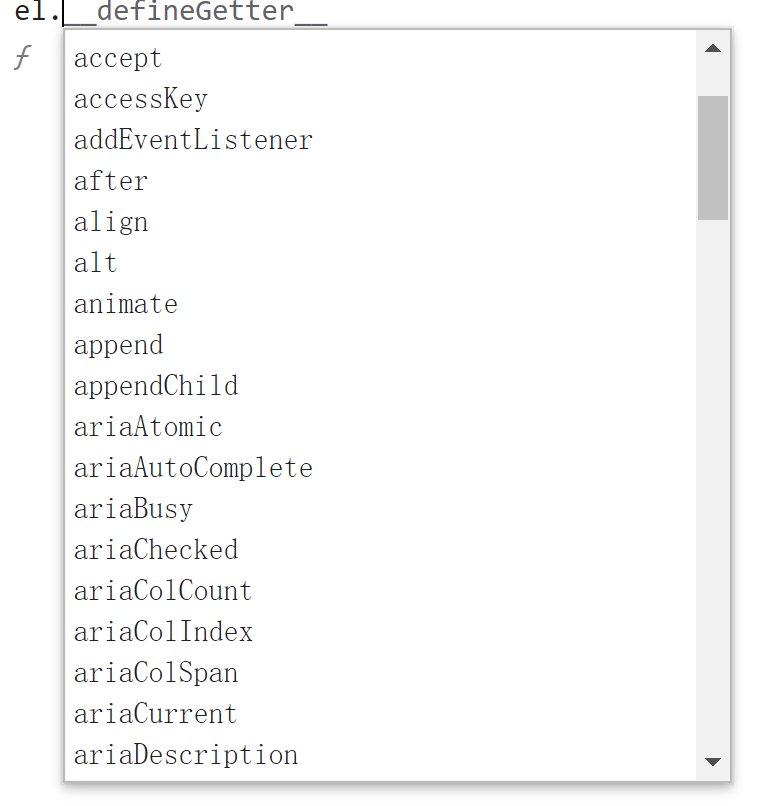
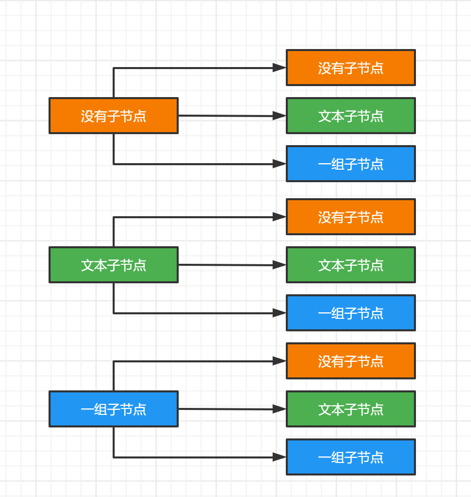
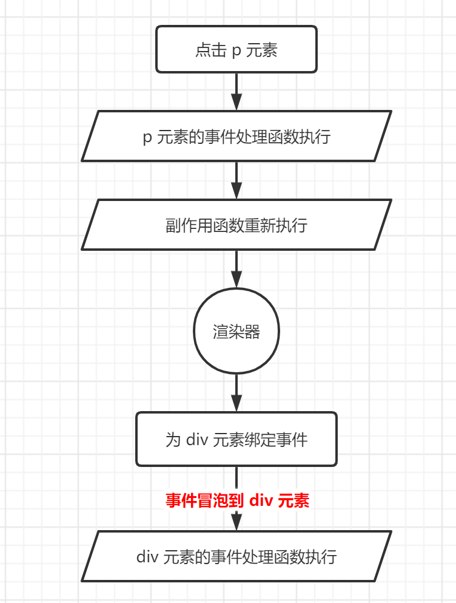
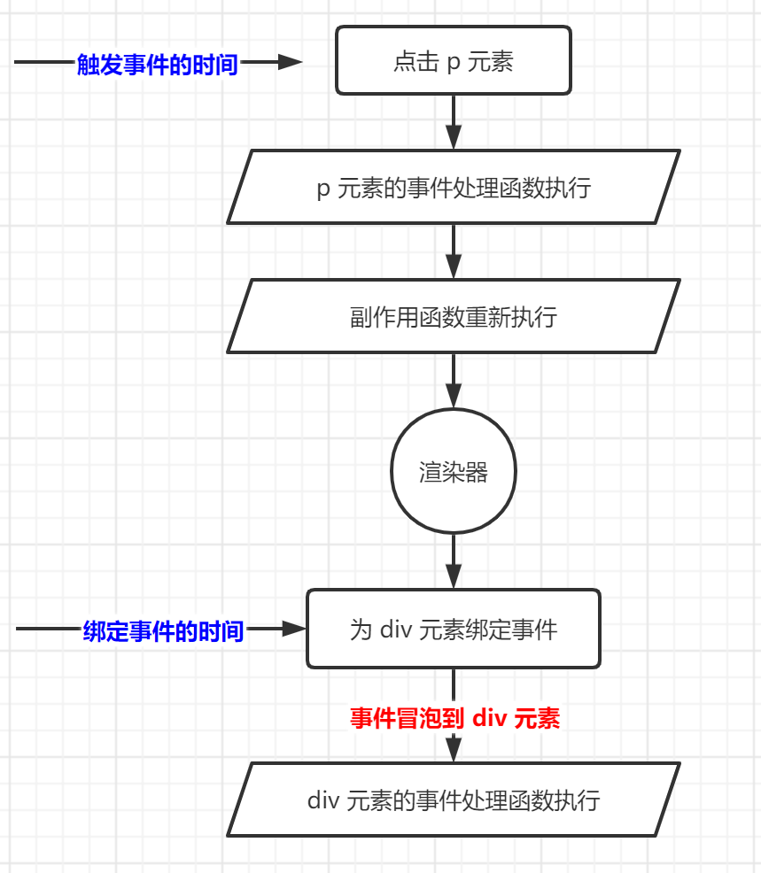

# 挂载与更新

## 挂载子节点和元素的属性

之前提到，当 `vnode.children` 的值是字符串类型时，会把它设置为元素的文本内容。一个元素除了具有文本子节点外，还可以包含其他元素的子节点，并且子节点可以是很多个。为了描述元素的子节点，我们需要将  `vnode.children` 定义为数组：

```js
const vnode = {
  type: 'div',
  children: [
    {
      type: 'p',
      children: 'hello'
    }
  ]
}
```

`vnode.children` 是一个数组，它的每一个元素都是一个独立的虚拟节点对象。这样就形成了树形结构，即虚拟 DOM 树。

为了完成子节点的渲染，我们需要修改 `mountElement()` 函数：

```js
function mountElement (vnode, container) {
  // 创建 DOM 元素
  const el = createElement(vnode.type)

  // 处理子节点，如果子节点是字符串，代表元素具有文本节点
  if (typeof vnode.children === 'string') {
    setElementText(el, vnode.children)
  } else if (Array.isArray(vnode.children)) {
    // 如果 children 是一个数组，则遍历每一个子节点，并调用 patch 函数挂载它们
    vnode.children.forEach(child => {
      patch(null, child, el)
    })
  }

  // 将元素添加到容器中
  insert(el, container)
}
```

完成了子节点的挂载后，我们再来看看如何用 vnode 来描述一个标签的属性，以及如何渲染这些属性。我们知道，HTML 标签有很多属性，其中有些属性是通用的，例如 id、class 等，而有些属性是特定元素都有的，例如 form 元素的 action 属性。实际上，渲染一个元素的属性比想象中要复杂，不过我们仍然秉承一切从简的原则，先来看看最基本的属性处理。

为了描述元素的属性，我们需要为虚拟 DOM 定义新的 `vnode.props` 字段：

```js
const vnode = {
  type: 'div',
  // 使用 props 描述一个元素的属性
  props: {
    id: 'foo'
  },
  children: [
    {
      type: 'p',
      children: 'hello'
    }
  ]
}
```

`vnode.props` 是一个对象，它的键代表元素的属性名称，它的值代表对应属性的值。这样，我们就可以通过遍历 props 对象的方法，把这些属性渲染到对应的元素上：

```js
function mountElement (vnode, container) {
    // 创建 DOM 元素
    const el = createElement(vnode.type)

    // 处理子节点，如果子节点是字符串，代表元素具有文本节点
    if (typeof vnode.children === 'string') {
      setElementText(el, vnode.children)
    } else if (Array.isArray(vnode.children)) {
      // 如果 children 是一个数组，则遍历每一个子节点，并调用 patch 函数挂载它们
      vnode.children.forEach(child => {
        patch(null, child, el)
      })
    }

    // 如果 vnode.props 存在，则处理
    if (vnode.props) {
      // 遍历 vnode.props，并将属性设置到元素上
      for (const key in vnode.props) {
        // el.setAttribute(key, vnode.props[key])
        el[key] = vnode.props[key]
      }
    }

    // 将元素添加到容器中
    insert(el, container)
  }
```

在上面的代码中，我们给出了两种为元素设置属性方案：`el.setAttribute(key, vnode.props[key])` 和 `el[key] = vnode.props[key]`。实际上，这两种方案都存在缺陷。如前文所述，为元素设置属性比想象中要复杂很多。在讨论缺陷之前，我们有必要先搞清楚两个重要的概念：**HTML Attributes** 和 **DOM Properties**。

## HTML Attributes 与 DOM Properties

理解这两者的差异和关联非常重要，这能够帮助我们合理地设计虚拟节点的结构，更是正确地为元素设置属性的关键。

我们先从最基本的 HTML 说起：

```html
<input id="my-input" type="text" value="foo" />
```

HTML Attributes 指的就是定义在 HTML 标签上的属性，这里指的就是 `id="my-input"`、`type="text"` 和 `value="foo"`。当浏览器解析这段 HTML 代码后，会创建一个与之相符的 DOM 元素对象。我们可以通过 JavaScript 代码来读取该 DOM 对象：

```js
const el = document.querySelector('#my-input')
```

这个对象包含很多**属性（properties）**，如图：



这些属性就是所谓的 DOM Properties。很多 HTML Attributes 在 DOM 对象上有与之同名的 DOM Properties，例如 `id="my-input"` 对应 `el.id`，`type="text"` 对应 `el.type`，`value="foo"` 对应 `el.value` 等。但 DOM Properties 与 HTML Attributes 的名字并不总是一样的，例如：

```html
<div class="foo"></div>
```

`class="foo"` 对应的 DOM Properties 则是 `el.className`。另外，并不是所有的 HTML Attributes 都有与之对应的 DOM Properties，例如：

```html
<div aria-valuenow="75"></div>
```

`aria-*` 类的 HTML Attributes 就没有与之对应的 DOM Properties。

类似地，也不是所有的 DOM Properties 都有与之对应的 HTML Attributes，例如可以用 `el.textContent` 来设置元素的文本内容，但并没有与之对应的 HTML Attributes 来完成同样工作。

HTML Attributes 与 DOM Properties 的值之间是有关联的，例如下面的 HTML 片段：

```html
<div id="foo"></div>
```

这个片段描述了一个具有 id 属性的 div 标签。其中，`id="foo"` 对应的 DOM Properties 是 `el.id`，并且值为字符串 `'foo'`。我们把这种 HTML Attributes 与 DOM Properties 具有相同名称（即 id）的属性值看作**直接映射**。但并不是所有 HTML Attributes 与 DOM Properties 之间都是直接映射关系，例如：

```html
<input value="foo" />
```

这是一个具有 value 属性的 input 标签。如果用户没有修改文本框的内容，那么通过 `el.value` 读取对应的 DOM Properties 的值就是 `'foo'`。而如果用户修改了文本框的值，那么 `el.value` 就是修改后的值。

例如，用户将文本框的内容修改为 `'bar'`，那么：

```js
console.log(el.value) // 'bar'
```

但如果运行下面的代码，会发生“奇怪”的现象：

```js
console.log(el.getAttribute('value')) // 'foo'
console.log(el.value) // 'bar'
```

可以发现，用户对文本框的修改并不会影响 `el.getAttribute('value')` 的返回值，这个现象蕴含着 HTML Attributes 所代表的意义。实际上，HTML Attributes 的作用是设置与之对应的 DOM Properties 的初始值。一旦值改变，那么 DOM Properties 始终存储着当前值，而通过 `getAttribute()` 函数得到的仍然是初始值。

但我们可以通过 `el.defaultValue` 来访问初始值：

```js
console.log(el.getAttribute('value')) // 'foo'
console.log(el.value) // 'bar'
console.log(el.defaultValue) // 'foo'
```

这说明一个 HTML Attributes 可能关联多个 DOM Properties。例如，上例中，`value="foo"` 就关联着 `el.value` 和 `el.defaultValue`。

虽然我们可以认为 HTML Attributes 是用来设置与之对应的 DOM Properties 的初始值，但有些值是受限制的，就好像浏览器内部做了默认值校验。如果你通过 HTML Attributes 设置的默认值不合法，那么浏览器会使用内建的合法值作为对应 DOM Properties 的默认值，例如：

```html
<input type="foo" />
```

我们知道，为 `<input />` 标签的 type 属性指定字符串 `'foo'` 是不合法，因此浏览器会矫正这个值：

```js
console.log(el.type) // 'text'
```

从上述的分析来看，HTML Attributes 与 DOM Properties 之间的关系很复杂，但其实我们只要记住一个核心原则即可：**HTML Attributes 的作用是设置与之对应的 DOM Properties 的初始值。**

## 正确地设置元素属性

对于普通的 HTML 文件来说，浏览器解析 HTML 代码后，会自动分析 HTML Attributes 并设置合适的 DOM Properties。但用户在编写 Vue.js 的单文件组件的模板不会被浏览器解析，这意味着，原本需要浏览器来完成的工作，现在需要框架来完成。

我们以禁用的按钮为例：

```html
<button disabled>Button</button>
```

浏览器在解析这段 HTML 代码时，会将该按钮设置为禁用状态，并将它的 `el.disabled` 这个 DOM Properties 的值设置为 `true`。但同样的代码如果出现在 Vue.js 的模板中，则情况会有所不同。首先，这个 HTML 模板会被编译成 vnode，它等价于：

```js
const vnode = {
  type: 'button',
  props: {
    disabled: ''
  },
  children: 'Button'
}
```

注意，这里的 `props.disabled` 的值是空字符串，如果在渲染器中调用 `setAttribute()` 函数设置属性，则相当于：

```js
el.setAttribute('disabled', '')
```

这么做的确没问题，浏览器会将按钮禁用。

但考虑如下模板：

```vue
<button :disabled="false">Button</button>
```

它对应的 vnode 为：

```js
const vnode = {
  type: 'button',
  props: {
    disabled: false
  },
  children: 'Button'
}
```

用户的本意是 “不禁用” 按钮，但如果渲染器仍然使用 `setAttribute()` 函数设置值，则会产生意外的效果，按钮被禁用了：

```js
el.setAttribute('disabled', false)
```

在浏览器中运行这段代码，我们发现浏览器仍然把按钮禁用了。这是因为 `setAttribute()` 函数设置的值总是会被字符串化，所以上面的代码相当于：

```js
el.setAttribute('disabled', 'false')
```

对于按钮来说，它的 `el.disabled` 属性值是布尔类型的，并且它不关心具体的 HTML Attributes 的值是什么，只要 `disabled` 属性存在，按钮就会被禁用。

所以我们发现，渲染器不应该用 `setAttribute()` 函数将 `vnode.props` 对象中的属性设置到元素上。那么应该怎么办？一个很自然的思路是，我们可以优先设置 DOM Properties：

```js
el.disabled = false
```

这样是可以正确工作的，但又带来了新的问题。还是以上面的模板为例：

```html
<button disabled>Button</button>
```

它对应的 vnode 是：

```js
const vnode = {
  type: 'button',
  props: {
    disabled: ''
  },
  children: 'Button'
}
```

如果直接用它设置元素的 DOM Properties，那么相当于：

```js
el.disabled = ''
```

因为 `el.disabled` 是一个布尔类型的值，所以这句代码相当于：

```js
el.disabled = false
```

这违背了用户的本意，因为用户希望禁用按钮 ，而 `el.disabled = false` 则是不禁用。

这么看来，无论是使用 `setAttribute()` 函数，还是直接设置 DOM Properties，都有缺陷。要彻底解决这个问题，我们只能做特殊处理，即优先设置元素的 DOM Properties，但当值为空字符串时，要手动将值矫正为 true。只有这样，才能保证代码的行为符合预期。下面给出 `mountElement()` 函数给出了具体的实现：

```js
function mountElement (vnode, container) {
    // 创建 DOM 元素
    const el = createElement(vnode.type)

    // 处理子节点，如果子节点是字符串，代表元素具有文本节点
    if (typeof vnode.children === 'string') {
      setElementText(el, vnode.children)
    } else if (Array.isArray(vnode.children)) {
      // 如果 children 是一个数组，则遍历每一个子节点，并调用 patch 函数挂载它们
      vnode.children.forEach(child => {
        patch(null, child, el)
      })
    }

    // 如果 vnode.props 存在，则处理
    if (vnode.props) {
      // 遍历 vnode.props，并将属性设置到元素上
      for (const key in vnode.props) {
        // 用 in 操作符判断 key 是否在对应的 DOM Properties
        if (key in el) {
          // 获取该 DOM Properties 的类型
          const type = typeof el[key]
          const value = vnode.props[key]

          // 如果是布尔类型，并且值是空字符串，则将值矫正为 true
          if (type === 'boolean' && value === '') {
            el[key] = true
          } else {
            el[key] = value
          }
        } else {
          // 如果要设置的属性没有对应的 DOM Properties，则使用 setAttribute 函数设置属性
          el.setAttribute(key, vnode.props[key])
        }
      }
    }

    // 将元素添加到容器中
    insert(el, container)
  }
```

但上面给出的实现仍然存在问题，因此有一些 DOM Properties 是只读的：

```html
<form id="form1"></form>
<input form="form1" />
```

`el.form` 是只读的，因此我们只能够通过 `setAttribute()` 函数来设置它：

```js
function shouldSetAsProps (el, key, value) {
  // 特殊处理
  if (key === 'form' && el.tagName === 'INPUT') return false
  // 兜底
  return key in el
}

function mountElement (vnode, container) {
  // 创建 DOM 元素
  const el = createElement(vnode.type)

  // 处理子节点，如果子节点是字符串，代表元素具有文本节点
  if (typeof vnode.children === 'string') {
    setElementText(el, vnode.children)
  } else if (Array.isArray(vnode.children)) {
    // 如果 children 是一个数组，则遍历每一个子节点，并调用 patch 函数挂载它们
    vnode.children.forEach(child => {
      patch(null, child, el)
    })
  }

  // 如果 vnode.props 存在，则处理
  if (vnode.props) {
    // 遍历 vnode.props，并将属性设置到元素上
    for (const key in vnode.props) {
      const value = vnode.props[key]
      // 使用 shouldSetAsProps 函数判断是否应该作为 DOM Properties 设置
      if (shouldSetAsProps(el, key, value)) {
        // 获取该 DOM Properties 的类型
        const type = typeof el[key]

        // 如果是布尔类型，并且值是空字符串，则将值矫正为 true
        if (type === 'boolean' && value === '') {
          el[key] = true
        } else {
          el[key] = value
        }
      } else {
        // 如果要设置的属性没有对应的 DOM Properties，则使用 setAttribute 函数设置属性
        el.setAttribute(key, vnode.props[key])
      }
    }
  }

  // 将元素添加到容器中
  insert(el, container)
}
```

如上面的代码所示，我们提取了一个 `shouldSetAsProps()` 函数，用于判断属性是否应该作为 DOM Properties 来设置。在该函数内，我们对 `<input form="xxx" />` 进行特殊处理。实际上，不仅仅是 `<input />` 标签，所有表单元素都具有 `form` 属性，它们都应该作为 HTML Attributes 来设置。

当然，`<input form="xxx" />` 是一个特殊的例子，还有一些其他类似于这种需要特殊处理的情况。我们就不一一列举了，因为掌握处理问题的思路更加重要。另外，我们也不可能把所有需要特殊处理的地方都记住，更何况我们根本不知道在什么情况下才需要特殊处理。所以，上述的解决方案本质是经验之谈。不要惧怕写出不完美的代码，只要在后续迭代中“见招拆招”，代码就会变得越来越完善，框架也会变得越来越健壮。

最后我们需要把属性的设置也抽象出来：

```js
const renderer = createRenderer({
  // 用于创建元素
  createElement(tag) {
    return document.createElement(tag)
  },
  // 用于设置元素的文本节点
  setElementText (el, text) {
    el.textContent = text
  },
  // 用于在给定的 parent 下添加指定元素
  insert (el, parent, anchor = null) {
    parent.insertBefore(el, anchor)
  },
  // 将属性设置相关的操作封装到 patchProps 函数中，并作为渲染器选项传递
  patchProps (el, key, prevValue, nextValue, shouldSetAsProps) {
    // 使用 shouldSetAsProps 函数判断是否应该作为 DOM Properties 设置
    if (shouldSetAsProps(el, key, nextValue)) {
      // 获取该 DOM Properties 的类型
      const type = typeof el[key]

      // 如果是布尔类型，并且值是空字符串，则将值矫正为 true
      if (type === 'boolean' && nextValue === '') {
        el[key] = true
      } else {
        el[key] = nextValue
      }
    } else {
      // 如果要设置的属性没有对应的 DOM Properties，则使用 setAttribute 函数设置属性
      el.setAttribute(key, nextValue)
    }
  }
})
```

而在 `mountElement()` 函数中，只需要调用 `patchProps()` 函数即可：

```js
function mountElement (vnode, container) {
    // 创建 DOM 元素
    const el = createElement(vnode.type)

    // 处理子节点，如果子节点是字符串，代表元素具有文本节点
    if (typeof vnode.children === 'string') {
      setElementText(el, vnode.children)
    } else if (Array.isArray(vnode.children)) {
      // 如果 children 是一个数组，则遍历每一个子节点，并调用 patch 函数挂载它们
      vnode.children.forEach(child => {
        patch(null, child, el)
      })
    }

    // 如果 vnode.props 存在，则处理
    if (vnode.props) {
      // 遍历 vnode.props，并将属性设置到元素上
      for (const key in vnode.props) {
        // 调用 patchProps 即可
        patchProps(el, key, null, vnode.props[key], shouldSetAsProps)
      }
    }

    // 将元素添加到容器中
    insert(el, container)
  }
```

## class 的处理

为什么需要对 class 属性进行特殊处理呢，这是因为 Vue.js 对 class 属性做了增强。在 Vue.js 中为元素设置类名有以下几种方式：

1. 指定为字符串值：`<p class="foo bar"></p>`；
2. 指定为一个对象：`<p :class="{ foo: true, bar: false }"></p>`；
3. 包含上述两种类型的数组：`<p :class="['foo bar', { baz: true }]">`。

可以看到 class 的值可以是多种类型，所以我们需要先把元素的 class 值格式化为统一的字符串形式，再把该字符串作为元素的 class 值去设置。因此，我们需要一个 `normalizeClass()` 函数：

```js
function normalizeClass(value) {
  let res = ''
  if (typeof value === 'string') {
    res = value
  } else if (Array.isArray(value)) {
    for (let i = 0; i < value.length; i++) {
      const normalized = normalizeClass(value[i])
      if (normalized) {
        res += normalized + ' '
      }
    }
  } else if (Object.prototype.toString.call(value) === '[object Object]') {
    for (const name in value) {
      if (value[name]) {
        res += name + ' '
      }
    }
  }
  return res.trim()
}
```

在浏览器中为一个元素设置 class 有三种方式：

1. `el.setAttribute()`；
2. `el.className`；
3. `el.classList`。

这三种方式中哪一种性能更好呢？由于时间关系，这里给出了答案：`el.className` 的方式的性能最优。所以我们需要调整 `patchProps()` 函数的实现：

```js
function patchProps (el, key, prevValue, nextValue, shouldSetAsProps) {
  if (key === 'class') {
    el.className = nextValue || ''
  } else if (shouldSetAsProps(el, key, nextValue)) {
    // 获取该 DOM Properties 的类型
    const type = typeof el[key]

    // 如果是布尔类型，并且值是空字符串，则将值矫正为 true
    if (type === 'boolean' && nextValue === '') {
      el[key] = true
    } else {
      el[key] = nextValue
    }
  } else {
    // 如果要设置的属性没有对应的 DOM Properties，则使用 setAttribute 函数设置属性
    el.setAttribute(key, nextValue)
  }
}
```

## 卸载操作

首次挂载完成后，后续渲染时如果传递了 null 作为新 vnode，则意味着什么都不渲染，我们需要卸载之前渲染的内容。

我们之前是通过 `el.innerHTML = ''` 来清空容器，但这么做是不严谨的，原因有三点：

1. 容器的内容可能是由某个或多个组件渲染的，当卸载操作发时，应该正确地调用这些组件的 `beforeUnmount()`、`unmounted()` 等生命周期函数；
2. 即使内容不是由组件渲染的，有的元素存在自定义指令，我们应该在卸载操作发生时正确执行对应的指令钩子函数；
3. 使用 `innerHTML` 清空容器元素内容不会移除绑定在 DOM 元素上的事件处理函数

所以我们需要根据 vnode 对象获取与其相关联的真实 DOM 元素，然后使用原生 DOM 操作方法将该元素移除。为此，我们需要在 vnode 与真实 DOM 元素之前建立联系，修改 `mountElement()` 函数：

```js
function mountElement (vnode, container) {
  // 创建 DOM 元素，并让 vnode.el 引用真实 DOM 元素
  const el = vnode.el = createElement(vnode.type)

  // 处理子节点，如果子节点是字符串，代表元素具有文本节点
  if (typeof vnode.children === 'string') {
    setElementText(el, vnode.children)
  } else if (Array.isArray(vnode.children)) {
    // 如果 children 是一个数组，则遍历每一个子节点，并调用 patch 函数挂载它们
    vnode.children.forEach(child => {
      patch(null, child, el)
    })
  }

  // 如果 vnode.props 存在，则处理
  if (vnode.props) {
    // 遍历 vnode.props，并将属性设置到元素上
    for (const key in vnode.props) {
      // 调用 patchProps 即可
      patchProps(el, key, null, vnode.props[key], shouldSetAsProps)
    }
  }

  // 将元素添加到容器中
  insert(el, container)
}
```

如此一来，当在卸载操作发生时，我们只需要根据虚拟节点对象 `vnode.el` 取得真实 DOM 元素，再将其从父元素中移除即可：

```js
function render (vnode, container) {
  if (vnode) {
    // 新 vnode 存在，将其与旧 vnode 一起传递给 patch 函数，进行更新
    patch(container._vnode, vnode, container)
  } else {
    if (container._vnode) {
      const el = container._vnode.el
      // 获取 el 的父元素
      const parent = el.parentNode
      // 调用父元素的 removeChild 移除元素
      if (parent) {
        parent.removeChild(el)
      }
    }
  }

  // 把 vnode 存储到 container._vnode 下，即后续渲染中的旧 vnode
  container._vnode = vnode
}
```

由于卸载操作是比较常见且基本的操作，所以我们应该将它封装到 `unmount()` 函数中，以便后续代码可以复用它：

```js
function render (vnode, container) {
  if (vnode) {
    // 新 vnode 存在，将其与旧 vnode 一起传递给 patch 函数，进行更新
    patch(container._vnode, vnode, container)
  } else {
    if (container._vnode) {
      unmount(container._vnode)
    }
  }

  // 把 vnode 存储到 container._vnode 下，即后续渲染中的旧 vnode
  container._vnode = vnode
}

function unmount (vnode) {
  // 获取 el 的父元素
  const parent = vnode.el.parentNode
  // 调用父元素的 removeChild 移除元素
  if (parent) {
    parent.removeChild(vnode.el)
  }
}
```

将卸载操作封装到 `unmount()` 中，还能带来两点额外的好处：

1. 在 `unmount()` 函数内，我们有机会调用绑定在 DOM 元素上的指令钩子函数；
2. 当 `unmount()` 函数执行时，我们有机会检测虚拟节点 vnode 的类型。如果该虚拟节点描述的是组件，那么我们也有机会调用组件相关的生命周期函数。

## 区分 vnode 的类型

此前，我们了解到，当后续调用 `render()` 函数渲染空内容（即 null）时，会执行卸载操作，如果传递了新的 vnode，则不会进行卸载操作，而是把新旧 vnode 都传递给  `patch()` 函数进行更新操作。回顾之前实现的 `patch()` 函数：

```js
function patch (n1, n2, container) {
  // 如果 n1 不存在，意味着挂载，则调用 mountElement 函数完成挂载
  if (!n1) {
    mountElement(n2, container)
  } else {
    // n1 存在，意味着更新，暂时省略
  }
}
```

其中，n1 和 n2 分别代表旧 vnode 与新 vnode。如果旧 vnode 存在，在需要在新旧 vnode 之间打补丁。但在具体执行打补丁操作之前，我们需要保证新旧 vnode 所描述的内容相同。这是什么意思呢？举个例子，假设初次渲染的 vnode 是一个 p 元素：

```js
const vnode = {
  type: 'p'
}
renderer.render(vnode, document.querySelector('#app'))
```

后续又渲染了一个 input 元素：

```js
const vnode = {
  type: 'input'
}
renderer.render(vnode, document.querySelector('#app'))
```

这就会造成新旧 vnode 所描述的内容不同，即 `vnode.type` 属性的值不同。对于上例来说，p 元素和 input 元素之间不存在打补丁的意义，因为对于不同的元素来说，每个元素都有特有的属性。

在这种情况下，正确的更新操作是：先将 p 元素卸载，再将 input 元素挂载到容器中。因此，我们需要调整 `patch()` 函数的代码：

```js
function patch (n1, n2, container) {
  // n1 存在，则对比 n1 和 n2 的类型
  if (n1 && n1.type !== n2.type) {
    // 如果两者类型不一致，则直接将旧 vnode 卸载
    unmount(n1)
    n1 = null
  }

  if (!n1) {
    mountElement(n2, container)
  } else {
    // 更新
  }
}
```

这里需要注意的是，卸载完成之后，我们应该把 n1 的值重置为 null，这样才能保证后续挂载操作正确执行。

即使新旧 vnode 描述的内容相同，我们仍然需要进一步确认它们的类型是否相同。我们知道，一个 vnode 可以用来描述普通标签，也可以用来描述组件，还可以用来描述 Frament 等。对于不同类型的 vnode，我们需要提供不同的挂载或更新的处理方式。所以我们需要继续修改 `patch()` 函数代码以满足需求：

```js
function patch (n1, n2, container) {
  // n1 存在，则对比 n1 和 n2 的类型
  if (n1 && n1.type !== n2.type) {
    // 如果两者类型不一致，则直接将旧 vnode 卸载
    unmount(n1)
    n1 = null
  }

  // 代码运行到这里，证明 n1 和 n2 所描述的内容相同
  const { type } = n2
  // 如果 n2.type 是字符串类型，则它描述的是普通标签元素
  if (typeof type === 'string') {
    if (!n1) {
      mountElement(n2, container)
    } else {
      // 更新
      // patchElement(n1, n2)
    }
  } else if (typeof type === 'object') {
    // 如果 n2.type 是对象，则它描述的是组件
  } else if (type === 'xxx') {
    // 处理其他类型的 vnode
  }
}
```

## 事件的处理

如何在虚拟节点中描述事件？事件可以视作为一种特殊的属性，因此我们可以约定，在 `vnode.props` 对象中，凡是以字符串 **on** 开头的属性都视作事件。例如：

```js
const vnode = {
	type: 'p',
  props: {
    // 使用 onXxx 描述事件
    onClick: () => {
      alert('clicked.')
    }
  },
  children: 'text'
}
```

我们再来看看如何将事件添加到 DOM 元素上。这非常简单，只需要在 `patchProps()` 调用 `addEventListener()` 函数绑定事件即可：

```js
patchProps (el, key, prevValue, nextValue, shouldSetAsProps) {
  // 匹配以 on 开头的属性，视其为事件
  if (/^on/.test(key)) {
    // 根据属性名称得到对应的事件名称，如 onClick -> click
    const name = key.slice(2).toLowerCase()
    // 绑定事件处理函数
    el.addEventListener(name, nextValue)
  } else if (key === 'class') {
    // ...
  } else if (shouldSetAsProps(el, key, nextValue)) {
    // ...
  } else {
    // ...
  }
}
```

那么，更新事件如何处理呢？按照一般的思路，我们需要先移除之前添加的事件处理函数，再将新的事件处理函数绑定到 DOM 元素上，如下面代码所示：

```js
patchProps (el, key, prevValue, nextValue, shouldSetAsProps) {
  // 匹配以 on 开头的属性，视其为事件
  if (/^on/.test(key)) {
    // 根据属性名称得到对应的事件名称，如 onClick -> click
    const name = key.slice(2).toLowerCase()
    // 移除上一次绑定的事件处理函数
    prevValue && el.removeEventListener(name, prevValue)
    // 绑定事件处理函数
    el.addEventListener(name, nextValue)
  } else if (key === 'class') {
    // ...
  } else if (shouldSetAsProps(el, key, nextValue)) {
    // ...
  } else {
    // ...
  }
}
```

这样做代码能够按照预期工作，但其实还有一种性能更优的方式来完成事件更新。

在绑定事件时，我们可以绑定一个伪造的事件处理函数 `invoker`，然后把真正的事件处理函数设置为 `invoker.value` 属性的值。这样当更新事件时，我们只需要更新 `invoker.value` 的值即可：

```js
patchProps (el, key, prevValue, nextValue, shouldSetAsProps) {
  // 匹配以 on 开头的属性，视其为事件
  if (/^on/.test(key)) {
    // 获取该元素的伪造事件处理函数 invoker
    let invoker = el._vei
    // 根据属性名称得到对应的事件名称，如 onClick -> click
    const name = key.slice(2).toLowerCase()

    if (nextValue) {
      // 如果没有 invoker，则将一个伪造的 invoker 缓存到 el._vei 中
      // vei 是 vue event invoker 的首字母缩写
      if (!invoker) {
        // 当伪造的事件处理函数执行时，会执行真正的事件处理函数
        invoker = el._vei = (e) => {
          invoker.value(e)
        }
        // 将真正的事件处理函数赋值给 invoker.value
        invoker.value = nextValue
        // 绑定 invoker 作为事件处理函数
        el.addEventListener(name, invoker)
      } else {
        // 如果 invoker 存在，意味着更新，只需要更新 invoker.value 的值即可
        invoker.value = nextValue
      }
    } else if (invoker) {
      // 新的事件绑定函数不存在，且之前绑定的 invoker 存在，则移除绑定
      el.removeEventListener(name, invoker)
    }
  } else if (key === 'class') {
    // ...
  } else if (shouldSetAsProps(el, key, nextValue)) {
    // ...
  } else {
    // ...
  }
}
```

实际上，伪造的事件处理函数的作用不止于此，它还能解决事件冒泡与更新之间相互影响的问题，下文会详细讲解。

但目前的实现仍然存在问题。现在我们将事件处理函数缓存在 `el._vei` 属性中，问题是，在同一时刻只能缓存一个事件处理函数。这意味着，如果一个元素同时绑定了多种事件，将会出现事件覆盖的情况。

为了解决这个问题，我们需要重新设计 `el._vei` 的数据结构。我们应该将 `el._vei` 设计为一个对象，它的键是事件名称，值则时对应的事件处理函数，这样就不会发生事件覆盖的现象了：

```js
patchProps (el, key, prevValue, nextValue, shouldSetAsProps) {
    // 匹配以 on 开头的属性，视其为事件
    if (/^on/.test(key)) {
      // 定义 el._vei 为一个对象，存储事件名称到事件处理函数的映射
      const invokers = el._vei || (el._vei = {})
      // 根据事件名获取 invoker
      let invoker = invokers[key]
      // 根据属性名称得到对应的事件名称，如 onClick -> click
      const name = key.slice(2).toLowerCase()

      if (nextValue) {
        if (!invoker) {
          // 将事件处理函数缓存到 `el._vei[key]` 下，避免覆盖
          invoker = el._vei[key] = (e) => {
            invoker.value(e)
          }
          // 将真正的事件处理函数赋值给 invoker.value
          invoker.value = nextValue
          // 绑定 invoker 作为事件处理函数
          el.addEventListener(name, invoker)
        } else {
          // 如果 invoker 存在，意味着更新，只需要更新 invoker.value 的值即可
          invoker.value = nextValue
        }
      } else if (invoker) {
        // 新的事件绑定函数不存在，且之前绑定的 invoker 存在，则移除绑定
        el.removeEventListener(name, invoker)
      }
    } else if (key === 'class') {
      // ...
    } else if (shouldSetAsProps(el, key, nextValue)) {
      // ...
    } else {
      // ...
    }
  }
```

另外，一个元素不仅可以绑定多种类型的事件，对于同一类型的事件而言，还可以绑定多个事件处理函数。因此，我们需要调整 `vnode.props` 对象中事件的数据结构：

```js
const vnode = {
  type: 'p',
  props: {
    onClick: [
      () => {},
      () => {}
    ]
  }
}
```

为了实现此功能，我们需要修改 `patchProps()` 函数中事件处理相关的代码：

```js
patchProps (el, key, prevValue, nextValue, shouldSetAsProps) {
    if (/^on/.test(key)) {
      const invokers = el._vei || (el._vei = {})
      let invoker = invokers[key]
      const name = key.slice(2).toLowerCase()

      if (nextValue) {
        if (!invoker) {
          // 将事件处理函数缓存到 `el._vei[key]` 下，避免覆盖
          invoker = el._vei[key] = (e) => {
            // 如果 invoker.value 是一个数据，则遍历它并逐个调用事件处理函数
            if (Array.isArray(invoker.value)) {
              invoker.value.forEach(fn => fn(e))
            } else {
              // 否则直接作用函数调用
              invoker.value(e)
            }
          }
          // 将真正的事件处理函数赋值给 invoker.value
          invoker.value = nextValue
          // 绑定 invoker 作为事件处理函数
          el.addEventListener(name, invoker)
        } else {
          // 如果 invoker 存在，意味着更新，只需要更新 invoker.value 的值即可
          invoker.value = nextValue
        }
      } else if (invoker) {
        // 新的事件绑定函数不存在，且之前绑定的 invoker 存在，则移除绑定
        el.removeEventListener(name, invoker)
      }
    } else if (key === 'class') {
      // ...
    } else if (shouldSetAsProps(el, key, nextValue)) {
      // ...
    } else {
      // ...
    }
  }
```

## 更新子节点

我们先讲一下如何更新子节点，之后再讲事件冒泡与更新时机的问题。我们在挂载子节点时，首先要区分其类型：

1. 如果 `vnode.children` 是字符串，说明元素具有文本子节点；
2. 如果 `vnode.children` 是数组，说明元素具有多个子节点。

为什么要区分其类型呢？其实这是一个规范性的问题，因为只有子节点规范化，才有利于我们编写更新逻辑。因此，我们需要先设定好子节点的规范。我们先看看在 HTML 页面中，元素的子节点都有哪些情况：

```html
<!-- 没有子节点 -->
<div></div>
<!-- 文本子节点 -->
<div>Some text</div>
<!-- 多个子节点 -->
<div>
  <p></p>
  <p></p>
</div>
```

对于一个元素来说，它的子节点无非就三种情况：

1. 没有子节点，此时 `vnode.children` 的值为 null；
2. 具有文本子节点，此时 `vnode.children` 的值为字符串，代表文本内容；
3. 其他情况，无论是单个元素子节点，还是多个子节点（可能是文本和元素的混合），都可以用数据来表示。

如下面的代码所示：

```js
// 没有子节点
vnode = {
  type: 'div',
  children: null
}
// 具有文本子节点
vnode = {
  type: 'div',
  children: 'Some text'
}
// 多个子节点
vnode = {
  type: 'div',
  children: [
    {
      type: 'p'
    },
    'Text'
  ]
}
```

现在我们已经规范化了 `vnode.children` 的类型。既然一个 vnode 的子节点可能有三种情况，那么当渲染器执行更新时，新旧子节点都分别是 3 种情况之一。所以我们可以总结出更新子节点时的全部 9 种可能：



但落实到代码，我们会发现其实并不需要完全覆盖这 9 种可能。接下来我们就开始着手实现：

```js
function patchElement (n1, n2) {
  const el = n2.el = n1.el
  const oldProps = n1.props
  const newProps = n2.props

  // 第一步：更新 props
  for (const key in newProps) {
    if (newProps[key] !== oldProps[key]) {
      patchProps(el, key, oldProps[key], newProps[key])
    }
  }
  for (const key in oldProps) {
    if (!key in newProps) {
      patchProps(el, key, oldProps[key], null)
    }
  }

  // 第二步：更新 children
  patchChildren(n1, n2, el)
}
```

如上面的代码所示，更新子节点是对一个元素进行打补丁的最后一步操作。我们将它封装到 `patchChildren()` 函数中，并将新旧节点以及当前正在被打补丁的 DOM 元素 el 作为参数传递给它。

`patchChildren()` 函数的实现如下：

```js
function patchChildren (n1, n2, container) {
  // 判断新子节点的类型是否是文本节点
  if (typeof n2.children === 'string') {
    // 旧子节点的类型有三种可能
    // 只有当旧子节点为一组子节点时，才需要逐个卸载，其他情况什么都不需要做
    if (Array.isArray(n1.children)) {
      n1.children.forEach(c => unmount(c))
    }
    // 最后将新的文本节点内容设置给容器元素
    setElementText(container, n2.children)
  } else if (Array.isArray(n2.children)) {
    // 如果新子节点的类型是一组子节点
    // 判断旧子节点是否也是一组子节点
    if (Array.isArray(n1.children)) {
      // **这里涉及到核心的 diff 算法**

      // 我们可以先用一种傻方式来处理
      // 就是将旧节点全卸载，重新挂载新的一组子节点
      n1.children.forEach(c => unmount(c))
      n2.children.forEach(c => patch(null, c, container))
    } else {
      // 此时：
      // 旧子节点要么是文本子节，要么不存在
      // 无论哪种情况，我们都只需要将容器清空，然后将新的一组子节点逐个挂载即可
      setElementText(container, '')
      n2.children.forEach(c => patch(null, c, container))
    }
  } else {
    // 代码运行到这里，说明新的子节点不存在
    // 如果旧的子节点是一组子节点，只需要逐个卸载即可
    if (Array.isArray(n1.children)) {
      n1.children.forEach(c => unmount(c))
    } else if (typeof n1.children === 'string') {
      // 旧子节点是文本节点，清空内容即可
      setElementText(container, '')
    }
    // 如果也没有旧子节点，那么什么都不需要做
  }
}
```

## 事件冒泡与更新时机问题

在上一节中，我们介绍了基本的事件处理。本节我们将讨论事件冒泡与更新时机相结合所导致的问题。为了更清晰地描述问题，我们需要构造一个小例子：

```js
const { effect, ref } = VueReactivity

const bol = ref(false)

effect(() => {
  const vnode = {
    type: 'div',
    props: bol.value ? {
      onClick: () => {
        alert('父元素 clicked')
      }
    } : {},
    children: [
      {
        type: 'p',
        props: {
          onClick: () => {
            bol.value = true
          }
        },
        children: 'text'
      }
    ]
  }
  // 渲染 vnode
  renderer.render(vnode, document.querySelector('#app'))
})
```

当首次渲染完成后，用鼠标点击 p 元素，会触发 div 元素的 click 事件处理函数执行吗？

答案其实很明显，在首次渲染完成后，由于 `bol.value` 的值为 false，所以渲染器并不会为 div 元素绑定点击事件。当用鼠标点击 p 元素时，即使 click 事件可以从 p 元素冒泡到父级元素，但由于 div 元素并没有绑定 click 事件的事件处理函数，所以什么都不会发生。

但打脸来得真快，当我们尝试运行上面的代码，并点击 p 元素时，一个 alert 弹窗亮瞎了我的狗眼。

为什么会这样呢？

当 p 点击被点击时，`bol.value` 变成 true，从而触发副作用函数重新执行，所以在更新阶段，div 会被绑定 click 事件的事件处理函数。当更新完后，p 元素的点击事件冒泡到父级，从而触发了 div 的 click 事件的事件处理函数。下图给出了更新和事件触发的流程：



从图上我们可以发现，之所以会出现上述奇怪的现象，是因为更新操作发生在事件冒泡之前，即**为 div 元素绑定事件处理函数发生在事件冒泡之前。**

那如何避免这个问题呢？我们仔细看上图就会发现，触发事件的时间与绑定事件的时间之间是有联系的：



可以发现，事件触发的时间要早于事件处理函数被绑定的时间。这意味着当一个事件触发时，目标元素上还没有绑定相关的事件处理函数，我们可以根据这个特点来解决问题：**屏蔽所有绑定时间晚于事件触发时间的事件处理函数的执行。**基于此，我们可以调整 `patchProps()` 函数中关于事件的代码，如下：

```js
patchProps (el, key, prevValue, nextValue, shouldSetAsProps) {
    if (/^on/.test(key)) {
      const invokers = el._vei || (el._vei = {})
      let invoker = invokers[key]
      const name = key.slice(2).toLowerCase()

      if (nextValue) {
        if (!invoker) {
          invoker = el._vei[key] = (e) => {
            // 如果事件发生的时间 早于 事件处理函数被绑定的时间
            // 则不执行事件处理函数
            if (e.timeStamp < invoker.attached) return

            if (Array.isArray(invoker.value)) {
              invoker.value.forEach(fn => fn(e))
            } else {
              invoker.value(e)
            }
          }
          invoker.value = nextValue
          // 添加 invoker.attached 属性，存储事件处理函数被绑定的时间
          invoker.attached = performance.now()
          el.addEventListener(name, invoker)
        } else {
          invoker.value = nextValue
        }
      } else if (invoker) {
        el.removeEventListener(name, invoker)
      }
    } else if (key === 'class') {
      // ...
    } else if (shouldSetAsProps(el, key, nextValue)) {
      // ...
    } else {
      // ...
    }
  }
```

这里有必要指出，在关于时间存储和比较方面，我们使用的是高精确度的 `performance.now()`。但根据浏览器的不同，`e.timeStamp`(事件触发的时间) 的值也会有所不同。它即可能是高精确度的时间，也可能是非高精确度的时间。因此，严格来讲，这里需要做兼容处理。不过在 Chrome 49、Firefox 54、Opera 36 以及之后的版本中，`e.timeStamp` 的值都是高精确度的时间。

## 文本节点和注释节点

在之前，我们只分析了一种类型的 vnode，即用于描述普通标签的 vnode。接下来，我们讨论如何用虚拟 DOM 描述更多类型的真实 DOM。其中最常见的两种节点类型是文本节点和注释：

```html
<div><!-- 注释节点-->我是文本节点</div>
```

那么，如何使用 vnode 来描述注释节点和文本节点呢？我们知道，如果 `vnode.type` 属性能够代表一个 vnode 的类型。如果 `vnode.type` 的值是字符串类型，则代表它描述的是一个普通标签，并且该值就代表标签的名称。但注释节点和文本节点不同于普通标签节点，它们不具有标签名称，所以我们需要人为创造一些唯一的标识，并将其作为注释节点和文本节点的 type 属性值，如下面的代码所示：

```js
const VNODE_TYPES = {
  Text: Symbol(),
  Comment: Symbol()
}

const newVnode = {
  type: VNODE_TYPES.Text,
  children: '我是文本内容'
}

const newVnode = {
  type: VNODE_TYPES.Comment,
  children: '我是注释内容'
}
```

有了描述注释节点和文本节点的 vnode 对象后，我们就可以使用渲染器来渲染它们了：

```js
function patch (n1, n2, container) {
  if (n1 && n1.type !== n2.type) {
    unmount(n1)
    n1 = null
  }

  const { type } = n2
  if (typeof type === 'string') {
    if (!n1) {
      mountElement(n2, container)
    } else {
      patchElement(n1, n2)
    }
  } else if (typeof type === 'object') {
    // 如果 n2.type 是对象，则它描述的是组件
  } else if (type === VNODE_TYPES.Text) {
    // 处理文本节点
    if (!n1) {
      // 如果没有旧节点，则进行挂载
      const el = n2.el = createText(n2.children)
      // 将文本节点插入到容器中
      insert(el, container)
    } else {
      // 如果旧 vnode 存在，只需要使用新文本节点的内容替换更新旧文本节点即可
      const el = n2.el = n1.el
      if (n2.children !== n1.children) {
        setText(el, n2.children)
      }
    } else if (type === VNODE_TYPES.Comment) {
      if (!n1) {
        const el = n2.el = createComment(n2.children)
        insert(el, container)
      } else {
        const el = n2.el = n1.el
        if (n2.children !== n1.children) {
          setComment(el, n2.children)
        }
      }
    }
  }
}
```

我们还需要把抽象出来的 `createText()` 和 `setText()` 等方法给封装到渲染器选项中：

```js
const renderer = createRenderer({
  createElement(tag) {},
  setElementText (el, text) {},
  insert (el, parent, anchor = null) {},
  patchProps (el, key, prevValue, nextValue, shouldSetAsProps) {},
  // 创建文本节点
  createText (text) {
    return document.createTextNode(text)
  },
  // 设置文本节点的内容
  setText(el, text) {
    el.nodeValue = text
  },
  // 创建注释节点
  createComment (comment) {
    return document.createComment(comment)
  },
  // 设置注释节点的内容
  setComment (el, text) {
    el.nodeValue = text
  }
})
```

## Fragment

与注释节点和文本节点类似，片段（Fragment）也没有所谓的标签名称，因此我们需要为片段创建唯一标识，即 Fragment。对于 Fragment 类型的 vnode 来说，它的 children 存储的内容就是模板中所有根节点：

```vue
<!-- Items.vue -->
<template>
	<li>1</li>
	<li>2</li>
	<li>3</li>
</template>
```

对应的 vnode 就是：

```js
const vnode = {
  type: VNODE_TYPE.Fragment,
  children: [
    { type: 'li', children: '1' },
    { type: 'li', children: '2' },
    { type: 'li', children: '3' }
  ]
}
```

当渲染器渲染 Fragment 类型的虚拟节点时，由于 Fragment 本身并不会渲染任何内容，所以只需要处理 Fragment 的子节点即可：

```js
function patch (n1, n2, container) {
    if (n1 && n1.type !== n2.type) {
      unmount(n1)
      n1 = null
    }

    const { type } = n2

    if (typeof type === 'string') {
      // ...
    } else if (typeof type === 'object') {
      // ...
    } else if (type === VNODE_TYPES.Text) {
      // ...
    } else if (type === VNODE_TYPES.Comment) {
      // ...
    } else if (type === VNODE_TYPES.Fragment) {
      // 处理 Fragment 类型的 vnode
      if (!n1) {
        n2.children.forEach(child => patch(null, child, container))
      } else {
        // 如果旧 vnode 存在，则只需要更新 Fragment 的 children 即可
        patchChildren(n1, n2, container)
      }
    }
  }
```

本质上来说，渲染 Fragment 与渲染普通元素的区别在于 Fragment 本身并不渲染任何内容，所以只需要处理它的子节点即可。

但仍需注意一点，`unmount()` 函数也需要支持 Fragment 类型的虚拟节点的卸载：

```js
function unmount (vnode) {
  if (vnode.type === VNODE_TYPES.Fragment) {
    vnode.children.forEach(c => unmount(c))
    return
  }

  // 获取 el 的父元素
  const parent = vnode.el.parentNode
  // 调用父元素的 removeChild 移除元素
  if (parent) {
    parent.removeChild(vnode.el)
  }
}
```

同样只需要卸载其 children 即可。

## 🚀 章节链接

- 上一章：[渲染器的设计](https://github.com/humandetail/VueJS-design-and-implementation/blob/master/notes/6.%E6%B8%B2%E6%9F%93%E5%99%A8%E7%9A%84%E8%AE%BE%E8%AE%A1.md)

- 下一章: [简单的 Diff 算法](https://github.com/humandetail/VueJS-design-and-implementation/blob/master/notes/8.%E7%AE%80%E5%8D%95%E7%9A%84%20Diff%20%E7%AE%97%E6%B3%95.md)